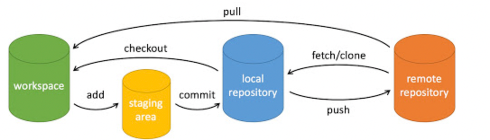

# Git-基本使用方法

## 1.1-基础知识

- Git 是一个开源的分布式版本控制系统，用于敏捷高效地处理任何或小或大的项目
- Git 是 Linus Torvalds 为了帮助管理 Linux 内核开发而开发的一个开放源码的版本控制软件
- Git 与常用的版本控制工具 CVS, Subversion 等不同，它采用了分布式版本库的方式，不必服务器端软件支持

- Git工作流程

  - 克隆操作

    将资源库克隆一份变为工作副本

  - 更新操作

    使用编辑、添加、删除、修改内容功能进行更新操作

    当其他人修改了资源库，你可以更新接受其他人的资源库

  - 推送操作

    检查修改内容，确定之后进行提交修改，完成推送操作

    

## 1.2-Git基本概念

- Git分为三个区域

  - 工作区

    就是电脑中当前能看到的目录

  - 暂存区

    英文名叫做stage或index,一般存放在.git目录下的index文件中，所以我们把暂存区叫做索引区

  - 版本区
  
    工作区有一个隐藏目录.git，这个不算工作区，而是git的版本区

## 1.3-创建一个git仓库并且推送到远程仓库的大概流程

- git init (初始化一个仓库)

  - 使用git init会初始化一个仓库，会在当前目录生成一个.git的目录，该目录包含了所有的元数据，其他的项目目录保持不变

  - 我们都知道，把大象放进冰箱要三步：打开冰箱，放入大象，关上冰箱，这里也是同理

    ```
    git init #初始化仓库，生成一个.git目录 （打开冰箱）
    git add ./<file> #添加一个文件或者当前目录所有内容到暂存区 （放入大象）
    git commit -m '注释' #将暂存区的文件提交到 （关上冰箱）
    ```

- 这三条命令可以创建一个仓库并且放入想放入的内容提交到本地仓库内，如果想要提交到远程的仓库则还需要添加一些命令

- ```
  git config --list #查看当前配置
  git config user.name 'zhangyuan' #设置当前用户名
  git config user.email 'xxx@qq.com' #设置当前用户邮箱
  git remote add origin git@github.com:zygithub-single/python-attack #添加一个远程账户
  git branch #查看当前分支名
  git push origin main #其中origin是添加的远程账户名称可以自定义，而main是当前的分支可以通过git branch查看
  ```

- git clone（远程克隆）

  - ```
    git clone git@github.com:zygithub-single/python-attack.git
    git clone https://github.com/zygithub-single/python-attack.git
    #上面两条命令都是克隆python-attack仓库到本地目录，第一条是ssh协议，第二条是https协议
    ```

- git config (配置)

- ```
  git config --list
  yuanzhang@YuandeMBP learning % git config --list
  credential.helper=osxkeychain
  user.name=zhangyuan
  user.email=1802850774@qq.com
  core.repositoryformatversion=0
  core.filemode=true
  core.bare=false
  core.logallrefupdates=true
  core.ignorecase=true
  core.precomposeunicode=true
  remote.origin.url=git@github.com:zygithub-single/learning.git
  remote.origin.fetch=+refs/heads/*:refs/remotes/origin/*
  branch.main.remote=origin
  branch.main.merge=refs/heads/main
  git config --global user.name 'zhangyuan' #设置仓库用户名（针对当前所有仓库生效）
  #如果去除--global则针对当前仓库生效
  ```

- git 基本操作(先混个眼熟即可)

  - git常用操作的是以下6个命令

    - git clone：克隆一个仓库到本地
    - git push：上传本地代码并且合并
    - git add：添加文件到暂存区
    - git commit ：提交本地暂存区的文件到本地版本区
    - git checkout：修改本地分支
    - git pull：下载远程代码并且合并

    

- 上图展示了6个命令的关系

- 图片分析：

  - workspace: 工作区
  - staging area: 暂存区/缓存区
  - local repository: 版本库或本地仓库
  - remote repository：远程仓库

- ```
  根据上面的初始化仓库引入，可以发现，我们现在可以通过git init创建一个本地仓库，然后通过git add <file> 加入想添加的文件，在通过git commit -m '提示内容' 将文件加入版本库这些操作都只是在本地仓库，如果我们需要将内容上传到远程仓库则需要通过git remote add <remote repository name> git@github:address 来添加远程仓库地址，然后再通过git push origin main将我们当前的分支上传到远程仓库，这里面我们涉及到了上面大部分的命令但是还有两条命令没有用到，就是git pulls以及git checkout，以及我们呢上面的git push origin main这条命令没有详细的讲清楚是干嘛用的，所以接下来我们先讲解分支管理
  ```

## 1.4-git-分支管理

- 一个分支代表一条独立的开发线，可以从主线上分离开来，从而不影响开发线路


- ### 创建一个分支

- 当你需要一个新的分支时，可以创建一个分支

  - ```
    git branch branchname
    ```

  - 当没有指定分支时，会显示当前分支

  - ```
    git branch
    main
    ```

    

- ### 切换一个分支

- 当你需要切换分支时，可以使用checkout切换分支

  - ```
    git checkout branchname
    ```

    

- ### 合并一个分支

- s当你需要合并分支时，可以使用merge

  - ```
    git megre
    ```

- ### 一个简易的案列( 体现出分支的效果 )

  ```
  yuanzhang@YuandeMBP test % git init
  hint: Using 'master' as the name for the initial branch. This default branch name
  hint: is subject to change. To configure the initial branch name to use in all
  hint: of your new repositories, which will suppress this warning, call:
  hint: 
  hint: 	git config --global init.defaultBranch <name>
  hint: 
  hint: Names commonly chosen instead of 'master' are 'main', 'trunk' and
  hint: 'development'. The just-created branch can be renamed via this command:
  hint: 
  hint: 	git branch -m <name>
  Initialized empty Git repository in /Users/yuanzhang/Documents/test/.git/
  yuanzhang@YuandeMBP test % 
  yuanzhang@YuandeMBP test % ls
  flag.txt
  yuanzhang@YuandeMBP test % ls -al
  total 8
  drwxr-xr-x   4 yuanzhang  staff  128  8  9 23:31 .
  drwx------@ 21 yuanzhang  staff  672  8  9 23:28 ..
  drwxr-xr-x   9 yuanzhang  staff  288  8  9 23:31 .git
  -rw-r--r--   1 yuanzhang  staff   11  8  9 23:28 flag.txt
  yuanzhang@YuandeMBP test % git add .
  yuanzhang@YuandeMBP test % git commit -m 'add flag.txt'
  [master (root-commit) d7fd882] add flag.txt
   1 file changed, 1 insertion(+)
   create mode 100644 flag.txt
  yuanzhang@YuandeMBP test % ls
  flag.txt
  yuanzhang@YuandeMBP test % git branch
  * master
  yuanzhang@YuandeMBP test % git branch test-branch
  yuanzhang@YuandeMBP test % git branch
  * master
    test-branch
  yuanzhang@YuandeMBP test % echo flag2 > flag2.txt
  yuanzhang@YuandeMBP test % ls
  flag.txt	flag2.txt
  yuanzhang@YuandeMBP test % git add flag2.txt
  yuanzhang@YuandeMBP test % git commit -m 'add flag2.txt'
  [master 2eb1af1] add flag2.txt
   1 file changed, 1 insertion(+)
   create mode 100644 flag2.txt
   yuanzhang@YuandeMBP test % git checkout test-branch
  Switched to branch 'test-branch'
  yuanzhang@YuandeMBP test % git branch #切换到test-branch分支中
    master
  * test-branch
  yuanzhang@YuandeMBP test % ls
  flag.txt
  yuanzhang@YuandeMBP test % git checkout master #再次切换到master分支里面
  Switched to branch 'master'
  yuanzhang@YuandeMBP test % git branch
  * master
    test-branch
  yuanzhang@YuandeMBP test % ls
  flag.txt	flag2.txt
  ```

  - 上面的创建分支和切换分支都是两条命令完成的，我们也可以一条命令完成这个操作

  - ```
    git checkout -b new-branch #添加一个-b参数即可
    ```

  - ### 删除一个分支

    ```
    git branch -d branchname
    yuanzhang@YuandeMBP test % git branch
    * master
      test-branch
    yuanzhang@YuandeMBP test % git branch -d test-branch
    Deleted branch test-branch (was d7fd882).
    yuanzhang@YuandeMBP test % git branch
    * master
    ```

  - ### 合并分支

  - git merge

  - 下面是一个小测试

    ```
    yuanzhang@YuandeMBP test % ls
    flag.txt	flag2.txt
    yuanzhang@YuandeMBP test % cat flag2.txt
    flag2
    yuanzhang@YuandeMBP test % vim flag2.txt
    yuanzhang@YuandeMBP test % cat flag2.txt
    flag2
    echo 1
    import os
    print('test')
    yuanzhang@YuandeMBP test % git checkout -b new 
    Switched to a new branch 'new'
    yuanzhang@YuandeMBP test % git branch
      master
    * new
    yuanzhang@YuandeMBP test % ls  
    flag.txt	flag2.txt
    yuanzhang@YuandeMBP test % cat flag2.txt
    flag2
    echo 1
    import os
    print('test')
    yuanzhang@YuandeMBP test % cat flag.txt
    flag{test}
    yuanzhang@YuandeMBP test % vim flag.txt
    yuanzhang@YuandeMBP test % cat flag.txt
    print('i"m a hacke')
    yuanzhang@YuandeMBP test % git merge new
    Already up to date.
    yuanzhang@YuandeMBP test % git checkout master
    M	flag.txt
    M	flag2.txt
    Switched to branch 'master'
    yuanzhang@YuandeMBP test % cat flag.txt
    print('i"m a hacke')
    ```

## 1.5-查看历史提交

- ### git log

  - 查看历史提交记录

  - ```
    yuanzhang@YuandeMBP learning % git log
    commit 78bbf5552f52f5db483b88d120ddce8cd93d4d0e (HEAD -> main, origin/main, origin/HEAD)
    Author: zhangyuan <1802850774@qq.com>
    Date:   Wed Aug 10 00:02:10 2022 +0800
    
        change file-name
    
    commit 71ebff78fb2740e6fe398cbb238829550ba17f49
    Author: zhangyuan <1802850774@qq.com>
    Date:   Tue Aug 9 10:53:47 2022 +0800
    
        update git泄露
    
    commit e5d9bc1aae57b36fd26146518485d7ed6df0dc28
    Author: 张园 <75836557+zygithub-singel@users.noreply.github.com>
    Date:   Mon Aug 8 11:38:48 2022 +0800
    
        Add files via upload
    ```

  - git log --oneline

    - 查看历史提交记录的简洁版

  - ```
    yuanzhang@YuandeMBP learning % git log --oneline
    78bbf55 (HEAD -> main, origin/main, origin/HEAD) change file-name
    71ebff7 update git泄露
    e5d9bc1 Add files via upload
    ```

    

- ### git blame

  - 以列表形式查看指定文件的历史修改记录

  - ```
    yuanzhang@YuandeMBP learning % git blame assets 
    fatal: no such path 'assets' in HEAD
    yuanzhang@YuandeMBP learning % git blame Git-基本使用方法.md 
    78bbf555 (zhangyuan         2022-08-10 00:02:10 +0800   1) # Git-基本使用方法
    78bbf555 (zhangyuan         2022-08-10 00:02:10 +0800   2) 
    78bbf555 (zhangyuan         2022-08-10 00:02:10 +0800   3) ## 1.1-基础知识
    78bbf555 (zhangyuan         2022-08-10 00:02:10 +0800   4) 
    78bbf555 (zhangyuan         2022-08-10 00:02:10 +0800   5) - Git 是一个开源的分
    布式版本控制系统，用于敏捷高效地处理任何或小或大的项目
    78bbf555 (zhangyuan         2022-08-10 00:02:10 +0800   6) - Git 是 Linus Torvalds 为了帮助管理 Linux 内核开发而开发的一个开放源码的版本控制软件
    78bbf555 (zhangyuan         2022-08-10 00:02:10 +0800   7) - Git 与常用的版本控
    制工具 CVS, Subversion 等不同，它采用了分布式版本库的方式，不必服务器端软件支持
    78bbf555 (zhangyuan         2022-08-10 00:02:10 +0800   8) 
    78bbf555 (zhangyuan         2022-08-10 00:02:10 +0800   9) - Git工作流程
    78bbf555 (zhangyuan         2022-08-10 00:02:10 +0800  10) 
    78bbf555 (zhangyuan         2022-08-10 00:02:10 +0800  11)   - 克隆操作
    78bbf555 (zhangyuan         2022-08-10 00:02:10 +0800  12) 
    78bbf555 (zhangyuan         2022-08-10 00:02:10 +0800  13)     将资源库克隆一份
    变为工作副本
    78bbf555 (zhangyuan         2022-08-10 00:02:10 +0800  14) 
    78bbf555 (zhangyuan         2022-08-10 00:02:10 +0800  15)   - 更新操作
    78bbf555 (zhangyuan         2022-08-10 00:02:10 +0800  16) 
    78bbf555 (zhangyuan         2022-08-10 00:02:10 +0800  17)     使用编辑、添加、
    删除、修改内容功能进行更新操作
    78bbf555 (zhangyuan         2022-08-10 00:02:10 +0800  18) 
    ```

## 1.6-版本回退

- git reset

  - 回退版本

  - ```
    yuanzhang@YuandeMBP learning % git reset 71ebff7 #回退到指定版本
    Unstaged changes after reset:
    D	git泄露.md
    yuanzhang@YuandeMBP learning % git log 
    commit 71ebff78fb2740e6fe398cbb238829550ba17f49 (HEAD -> main)
    Author: zhangyuan <1802850774@qq.com>
    Date:   Tue Aug 9 10:53:47 2022 +0800
    
        update git泄露
    
    commit e5d9bc1aae57b36fd26146518485d7ed6df0dc28
    Author: 张园 <75836557+zygithub-singel@users.noreply.github.com>
    Date:   Mon Aug 8 11:38:48 2022 +0800
    
        Add files via upload
    yuanzhang@YuandeMBP learning % git log --oneline
    71ebff7 (HEAD -> main) update git泄露
    e5d9bc1 Add files via upload
    ```

## 1.7-结束语：

到目前为止，我们已经学习了git的日常管理，以及本地和远程仓库的推送，这些操作已经足够我们日常使用，如果需要更详细的教程，可以直接查阅帮助文档或者访问：https://git-scm.com/book/en/v2

