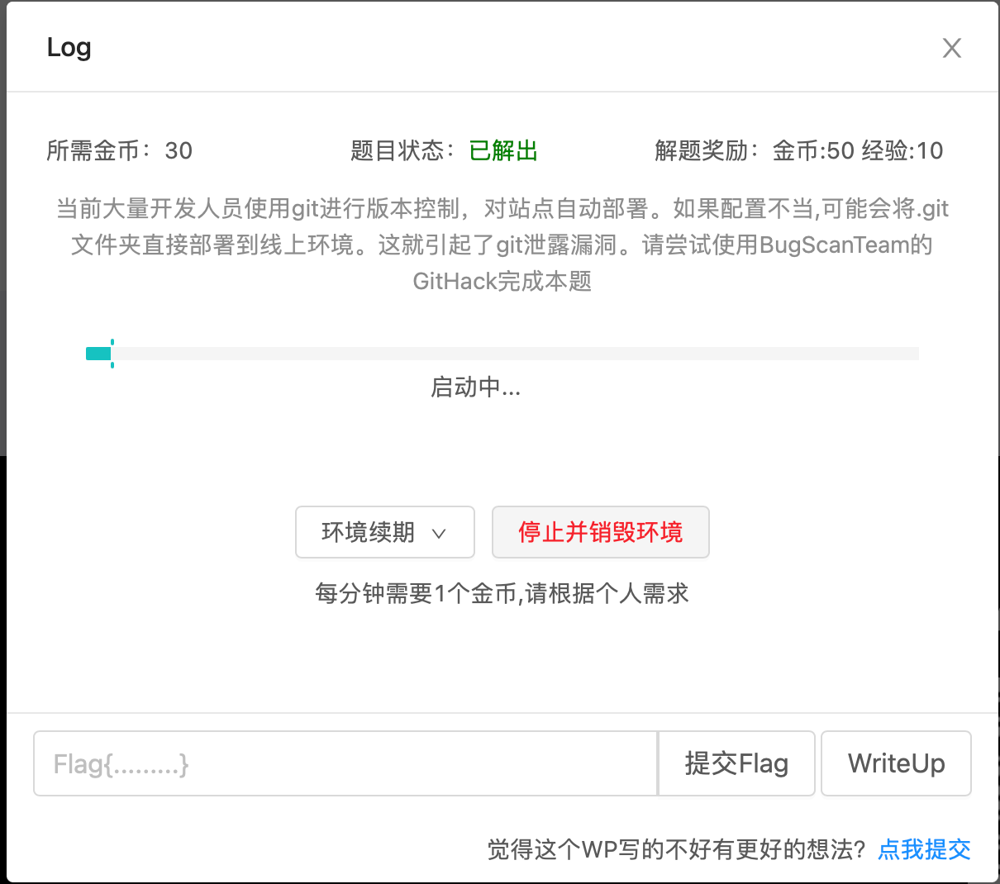
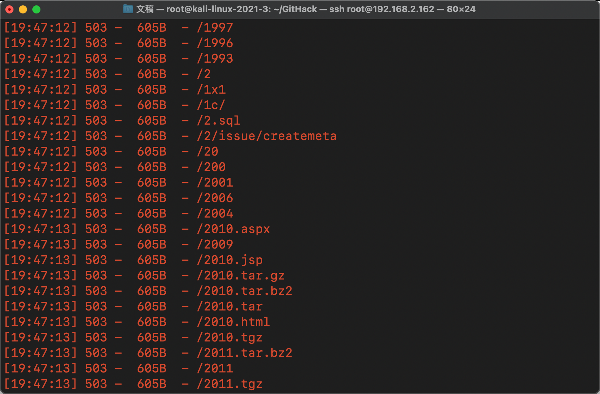
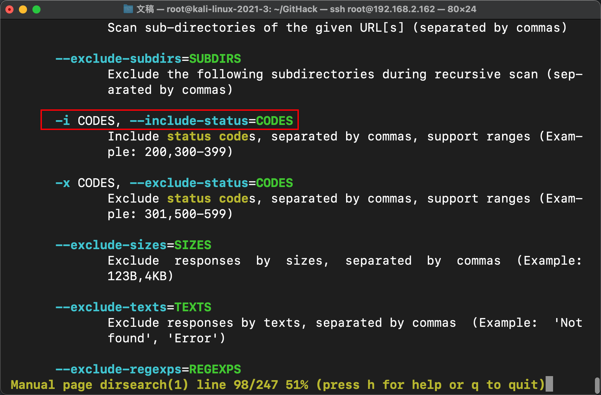
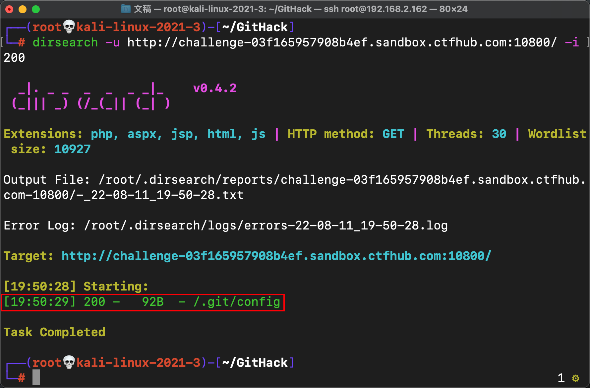
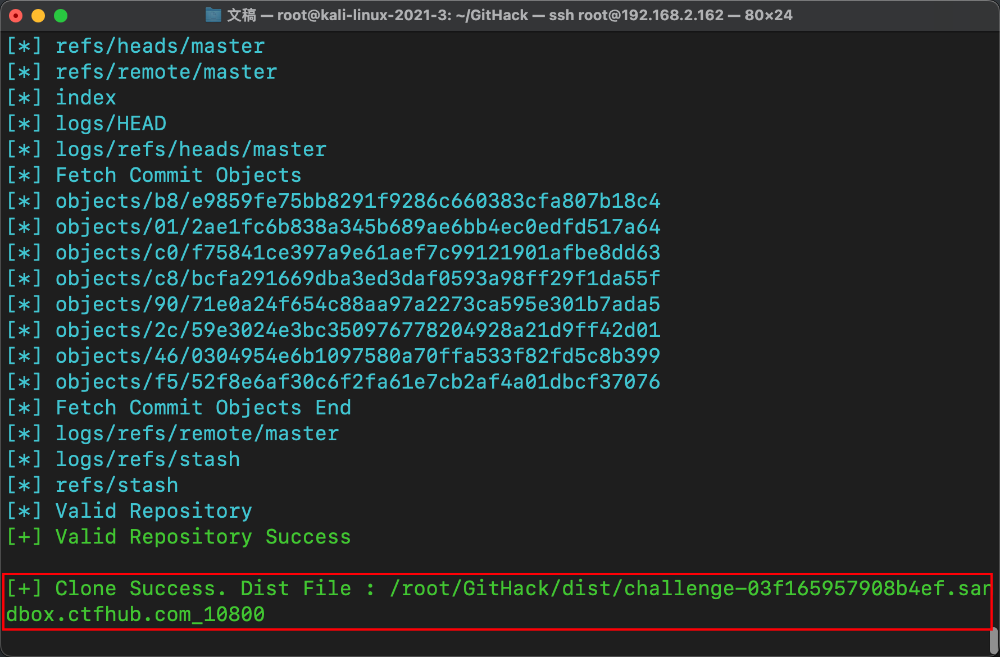
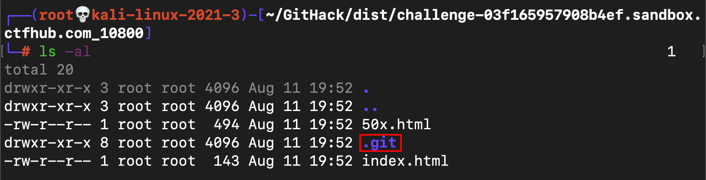
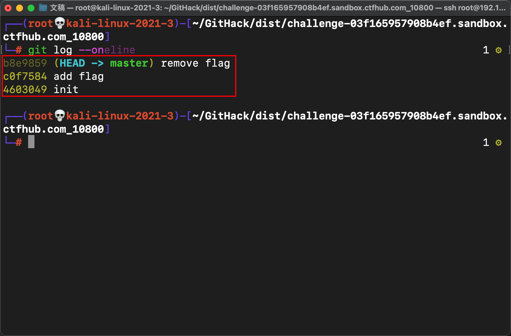
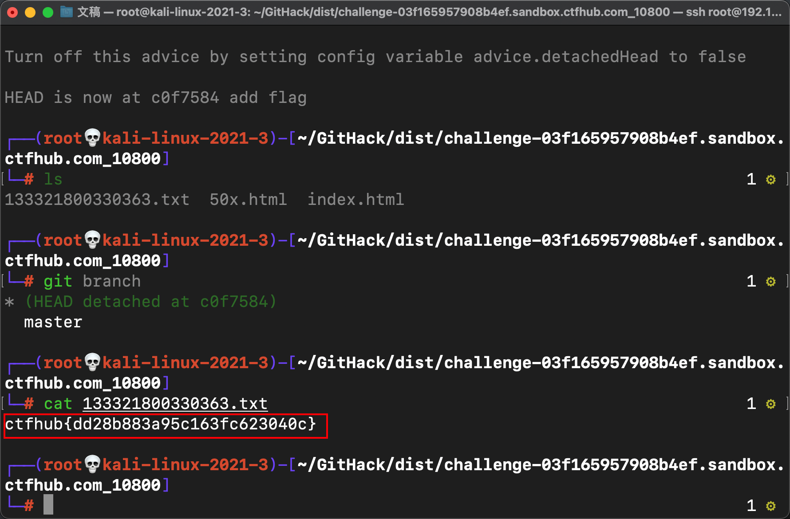
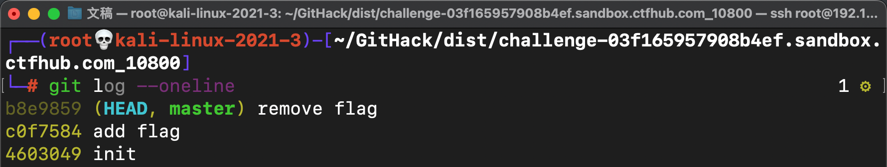
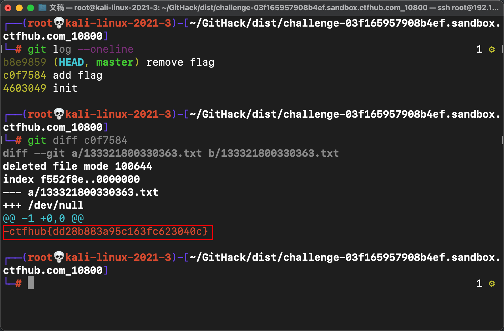

# Git-泄露

## 1.1-Git泄露工具介绍

- `.git` 泄漏利用工具，可还原历史版本

- 下载地址：https://github.com/BugScanTeam/GitHack.git 或者 git@github.com:BugScanTeam/GitHack.git

- 依赖环境：

- 不需要安装其它 Python 库，只需要有 git 命令即可

- 使用方法：

```
python GitHack.py http://www.example.com/.git/
```

## 1.2-Git泄露示例

- 首先在ctfhub中打开一个git泄露实列
- 

- 这里我选的是一个log实列

- 首先使用dirsearch工具进行目录扫描

- ```
  └─# dirsearch -u http://challenge-03f165957908b4ef.sandbox.ctfhub.com:10800/
  ```

  

- 扫描到的状态码大多都是503
- 

- 这样的结果很繁琐，所以我们利用dirsearch中的 -i 参数进行状态码过滤
- 

- 使用命令：

- ```
  └─# dirsearch -u http://challenge-03f165957908b4ef.sandbox.ctfhub.com:10800/ -i 200
  ```

- 

- 上图中可以看到扫描到一个.git目录，说明存在git泄露的可能，接下来我们呢利用GitHack工具将.git目录中的内容都dump下来

- ```
  └─# python2 GitHack.py http://challenge-03f165957908b4ef.sandbox.ctfhub.com:10800/.git
  ```

  

- 查看/root/GitHack/dist/challenge-03f165957908b4ef.sandbox.ctfhub.com_10800目录
- 

## 1.2.1-方法1：

- 发现一个.git目录，使用git log查看该目录

- ```
  git log --oneline #以简单的形式查看该目录
  ```

  

- 可以看到当前分支为remove flag分支，我们只需要跳转到add flag分支即可得到flag

- ```
  git checkout c0f7584
  ```

  

- 通过跳转分支果然得到flag

## 1.2.2-方法2：

- 查看历史记录

- ```
  git log --oneline
  ```

  

- 

- 对比add flag分支不同的地方

- ```
  git diff c0f7584
  ```

  

- 可以看出很轻松得到了flag

## 1.3-总结：

- git泄露一般情况下先利用扫描工具扫描目录发现.git目录大概率说明这个目录存在git泄露
- 然后使用GitHack这类工具进行数据下载
- 下载到本地目录之后利用git命令进行信息搜集

