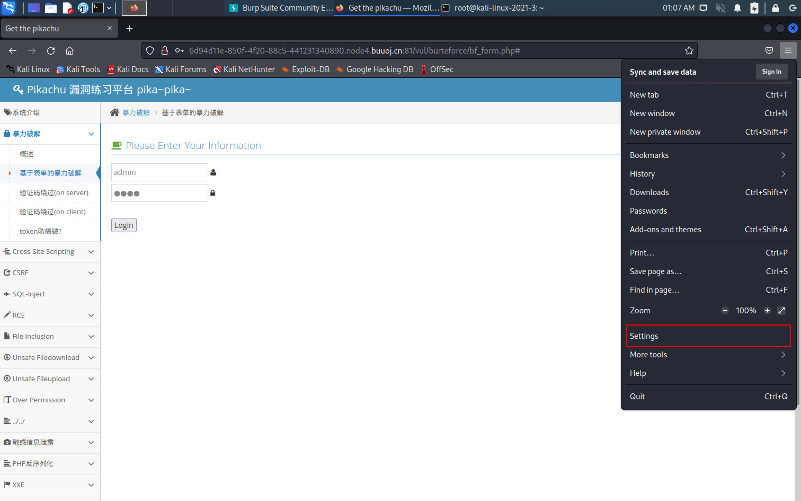
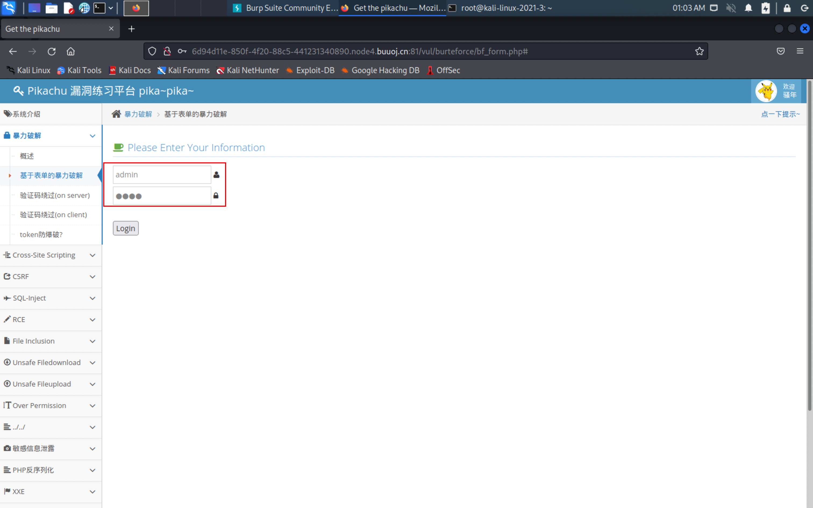
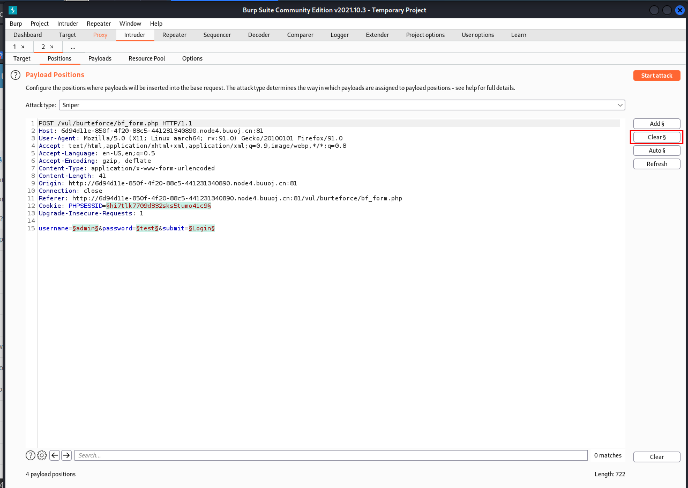

# 1.4-弱口令

## 1.1-常规弱口令爆破

- 平台--pikachu

- 下载地址：https://github.com/zhuifengshaonianhanlu/pikachu

- 下载完成后直接放入web服务器配置一下数据库账号密码即可

- 如果懒得配置可以直接在buuctf中开启一个免费的靶场，只需要注册一下就好了

- 

- 这里我们首先使用admin账户+随机密码登录（使用bp抓包）

- bp--配置：

  - 一般情况下默认配置为127.0.0.1:8080
  - 
  - 我们在火狐浏览器中设置一下代理指向127.0.0.1:8080即可
  - 
  - 

  - 开启bp的截取功能
  - 
  - 点击login就会弹出如下界面
  - 
  - 其中username,password是我们可控的变量，由于我们知道账号为admin，因此只需要添加一个pyaload即可
  - 按住ctrl+I发送到爆破模块，按下clear清理所有变量
  - 
    - 然后在password位置添加一个payload
    - 
    - 然后加载一个你准备好的字典即可
    - 
    - 按下start attack就开始暴力破解了
    - 
    - 可以看到密码为123456时，长度和别的不一样，经过查看回显发现登录成功，这就是密码
    - 

## 1.2-默认口令

- 什么是默认口令?

- 常见安全产品如：防火墙、交换机、[路由器](https://so.csdn.net/so/search?q=路由器&spm=1001.2101.3001.7020)等设备的默认口令！！！
- 这个时候就需要我们善用百度了，例如搜索常见的默认口令
- 
- 可以找到很多的默认口令，有很多的CMS,路由器等都是存在默认口令的，如果厂商安全机制不完善，第一次初始化设备可以不重置密码，那么我们可以直接利用这些默认密码登录目标网站
- 因此我们遇到一个CMS的时候可以先尝试查找该CMS的官方网站给出的默认密码，尝试登录即可