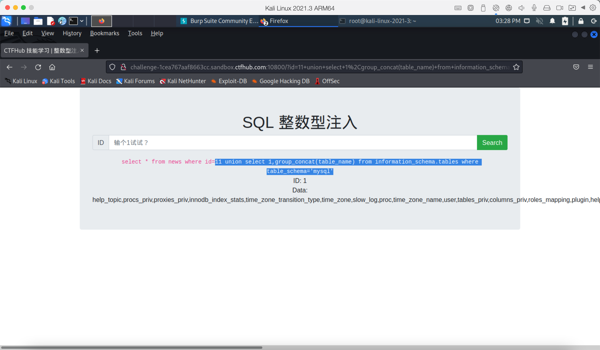
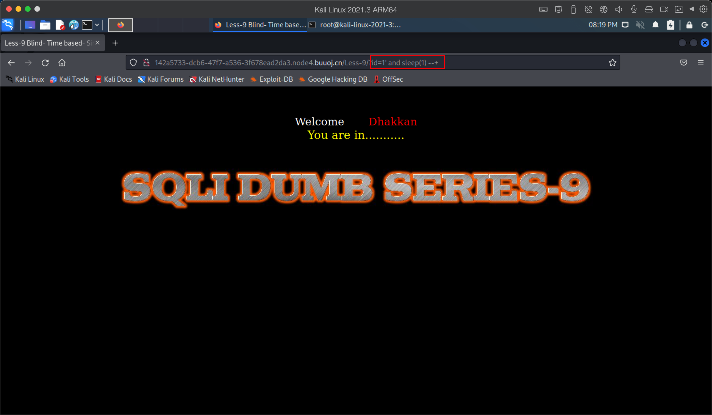
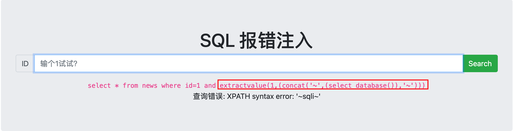

# 1.5-sql-注入

- 学习这个之前需要有mysql基础+php基础，如果对于这两个不了解，请移至https://www.runoob.com
- 上面的链接是菜鸟教程，可以学习mysql+php


## 1.1-整型注入

- 这里我们拿ctfhub来做实验

- 

- 可以看到上图中有一个sql语句

- ```
  select * from news where id=1
  ```

- 这其中的变量1是我们可控的，sql注入的关键就在于这个可控的变量，在这之前，我们需要学习前置知识

- mysql中的union联合语句

  - union联合语句是什么？

    - MySQL UNION 操作符用于连接两个以上的 SELECT 语句的结果组合到一个结果集合中。多个 SELECT 语句会删除重复的数据。

  - union联合语句可以干啥？

    - 在日常操作中可以同时查询两个字段数量相同数据

  - union联合语句语法是什么？

    - ```
      SELECT expression1, expression2, ... expression_n
      FROM tables
      [WHERE conditions]
      UNION [ALL | DISTINCT]
      SELECT expression1, expression2, ... expression_n
      FROM tables
      [WHERE conditions];
      ```

    - 可以看出union只是负责将两个select语句连接起来，起到同时执行两个select语句，其中还有两个参数，一个ALL和一个DISTINCT

      - ALL: 可选，返回所有结果集，包含重复数据。
      - DISTINCT:可选，删除结果集中重复的数据。默认情况下 UNION 操作符已经删除了重复数据，所以 DISTINCT 修饰符对结果没啥影响。（默认）

  - 知道了以上前置知识之后咱就可以尝试sql注入了

  - 

  - 当我们输入id为2的时候会回显一个skill的数据，如果为1的时候会回显一个ctfhub的数据，由于变量可控，我们就可以尝试使用union联合查询，union联合查询有一个特点，当我们查询的第一个select语句无效，则会返回第二个select语句的数据，但是我们前面的字段和后面一个select的字段一定要一致，因此我们第一步是拆解字段数

  - 拆解字段数可以使用order by num 语句

  - 

  - 上图是order by 字段的作用，根据order by的特性，可以用下标作选择第几个字段，如果字段存在则返回数据，如果不存在则报错，那么我们可以根据order by 一个数字来判断字段数量

  - 

  - 上图中我的变量不仅仅写的是1而是 1 order by 1 #，这里面的井号表示的是mysql的注释，一般情况是为了闭合才写的，这里因为是数字型注入，所以不写也没关系

  - 

  - 

  - 根据上面两张图片可以发现字段为2的时候存在数据，为3的时候不返回数据，则表示该语句返回的字段数为2个

  - 

  - 根据上图可以发现执行成功，说明存在union联合注入

  - 

  - 这个时候我们尝试让第一个select语句报错，于是输入了一个11，因为数据库中不存在11所以就返回了第二个select字段，第二个select查询结果应该是 1,2 这里可以看到id回显为1，data回显为2

  - 我们先查询一下mysql的版本

  - 

  - 可以看到是mariadb 10.3.22这个和mysql8版本相似（因为mariadb和mysql是同一个人写的，所以差异并不大）

  - 于是我们可以查询所有的数据库名称，在这之前我们需要知道一个数据库（information_schema)

  - 

  - information_schema数据库是MySQL系统自带的数据库，它提供了数据库元数据的访问方式，包含了所有的数据库名和表名以及字段名

  - 构造以下语句查询数据库

  - ```
    11 union select 1,group_concat(schema_name) from information_schema.schemata
    ```

    - group_concat() --> 将group by产生的同一个分组中的值连接起来，返回一个字符串结果。

  - 

  - 查询mysql数据表

  - ```
    11 union select 1,group_concat(table_name) from information_schema.tables where table_schema='mysql'
    ```

  - 

  - 查询user字段名

  - ```
    11 union select 1,group_concat(column_name) from information_schema.columns where table_schema='mysql'
    ```

    

  - 

  - 查询user,authentication_string数据

  - ```
    11 union select 1,group_concat(User,authentication_string) from mysql.user
    ```

    

  - 

  - 这里我在sqli数据库中找到了flag表

  - 

  - 查询flag表的所有字段

  - ```
    11 union select 1,group_concat(column_name) from information_schema.columns where table_schema='sqli'
    ```

    

  - 查询flag

  - ```
    11 union select 1,group_concat(flag) from sqli.flag
    ```

    

  - 

  - 至此咱的数字型注入就结束了，如果换成其他类型的注入除了构造payload不同以外，其他的查询都是一样的，因此，之后的其他类型注入我们只找到注入点，详细的查询参考上面的数字型注入即可或者直接使用sqlmap也行


## 1.2-字符型注入

- 接下来为了方便查看源码我在本地搭建了一个sql注入的靶场，使用的是php7的sqli-labs
- 下载地址：https://github.com/skyblueee/sqli-labs-php7
- 或者直接使用buuctf中的sqli-labs靶场，可以自己复刻一份源码在本地上查看
- 打开sqli-labs的第三关我们直接查看是get请求，提示我们添加一个id参数
- 

- 这里我们先来查看一下源码

- 

- 可以看到我们的可控变量是$id也就是我们上面的id=2的位置，这个2是我们可控的变量，因为传参的时候没有经过任何过滤，因此我们呢可以构造一个payload

- ```
  1') order by 1 --+
  ```

- 

- 这里的注释使用--+代替，因为--+解码后是-- (注意有一个空格)，由于-- 在mysql中是注释的意思，因此之后的limit内容都注释掉了我们也就可以构造union联合语句了

- 

- 构造以下payload测试

- ```
  id=1') order by 3 --+
  ```

  

- 

- 发现有3个字段

- 构造union联合语句,需要注意将前一个select语句中的1修改为不存在的数值使其报错才能回显第二个select语句

- ```
  id=@') union select 1,2,3 --+
  ```

  

- 

- 可以看到回显的是2,3说明可以依靠2,3字段回显的结果来查看返回结果

- 可以看到当前数据库是security,用户是root@localhost

- 

- 至此，我们的单引号字符注入成功，接下来可以通过sqlmap工具取得你想要的内容
- 关于sqlmap使用方法参考中文手册即可
- slqmap中文手册：https://sqlmap.kvko.live
- 

## 1.3-sql-盲注

- ### 基于布尔的盲注：

  - 在学习布尔盲注之前需要有截取字符串的基础知识

  - 参考链接：https://www.lanzoui.com/iavfane

  - 这里需要三个函数mid,substr,left 这三个函数都是截取字符串的函数

  - mid(string,start,length)

    - string:需要截取的字符串
    - start:截取开始的位置
    - length:需要截取的长度
    - 
    - 以上先使用了security数据库，那么当前的database()函数里面的结果是security,然后使用mid函数从第一个字符开始截取，截取一个，因此返回了s这个字符

  - substr(string,start,length) #这个函数和mid()一模一样这是mid函数的别名

  - left(string,length)

    - string:要截取的字符串
    - length:从左边第一个字符开始截取的长度
    - 
    - 上图中可以看出database()查询结果为security,我们使用left函数查找2位，于是从左往右se这两个字符就变成了结果返回给我们

  - 

  - 上图中的sql语句是基于刚刚的left加了一个> 'a'字符串，这里表示的是逻辑，在mysql中0表示true,1表示false,所以我们可以看到,字符's'>'a'返回的结果为0是成立的，同样因为's' <'t',因此's'>'t'是不成立的，上图中返回了一个1

  - ascii函数：

  - 

  - 将字符串转化为ascii码

  - 布尔注入实战

    - 方法一：

    - 打开sqli-labs第五关，可以发现这里给输入一个id返回的结果是your are in,而不是返回一个用户名

    - 

    - 当我们键入一个不存在的ID时，则不返回任何数据

    - 

    - 

    - 

    - 经过测试可以发现上图中是单引号闭合，我们可以通过IF语句来进行判断当前数据库的长度

    - 利用mid函数取出当前数据库的第一个字符然后转换为ascii码再进行判断

    - ```
      id=1' and ord(mid((select database()),1,1)) =115--+
      ```

    - 

    - 

    - 判断字符小于97的时候没有返回任何结果，说明存在注入点

    - 当我们的ascii码大于65小于90的时候，说明当前的字符为大写字母，如果大于97小于122的时候则表示为小写字母,可以借助这个特性加上二分法快速判断每个字符然后完成拼接

    - 方法二：

    - if(exp1,exp2,exp3) 执行exp1如果成功则返回exp2失败则返回exp3

    - 利用if的特性返回TRUE OR FALSE就可以判断字符了

    - 

    - 

    - 上图中<97的ascii码返回的是FALSE说明存在布尔盲注

- ### 基于时间的盲注：

  - 时间注入和前面布尔盲注差不多，只不过是在布尔盲注的基础上加了一个sleep()，通过返回的时间来判断结果而已

  - sleep(1) ：暂停一秒返回结果

  - 如果使用python脚本写的话需要用到requests模块中的res.elapsed.seconds来获取返回的时间从而判断结果

  - 这里我们用sqli-labs第九关讲解

  - 

  - 上图中的sleep(1)是核心，如果成功暂停一秒然后返回结果则表明该注入点存在sql注入

  - 分析源码：

    - 

    - 可以看到无论是执行成功还是失败都返回You are in ...，所以我们只需要用sleep来进行判断即可，构造以下paylaod

    - ```
      1' and sleep(2)
      ```

    - 网页此时停留了2秒左右，因此存在时间盲注

    - 

- ### 基于报错的盲注：

  - extractvalue报错注入

  - 

  - 从官方文档看，第一个值为xml文档的地址，第二个值为xpath的表达式，两个都是字符类型，而我们这里的报错注入，就是为了让xpath语法出错，从而导致mysql提示报错位置以及内容，这里我们在xpath位置插入一段sql语句，就可以将sql语句执行好的结果返回给sql了

  - 

  - updatexml报错注入

  - 

  - 这个和extractvalue报错原理一致，只是用法不同，需要在目标文件和表达式的基础之上再添加一个新目标文件名称即可

  - 报错注入实验：

    - 

    - 

    - 从上图的报错结果来看，可以判断sql语句：

    - ```
      select user from mysql.user where id=("$id") limit 0,1
      ```

    - 根据上边的语句我们可以构造一个报错注入paylaod

    - ```
      1") and extractvalue(1,(concat(0x7e,(select database())))) --+
      ```

    - 这个报错语句有一个限制，返回的结果不能超过32个字节，超出部分将不会显示出来

    - 

    - 如果构造updatexml()报错同理

    - 修改paylaod如下：

    - ```
      1") and updatexml(1,(concat(0x7e,(select database()))),1) --+
      ```

    - 

    - 至此，盲注就这么结束了，详细的获取flag过程和上面的联合语句差不多，只不过更加废时间，因此建议使用python写一个sql脚本，更加具有针对性，速度也可观