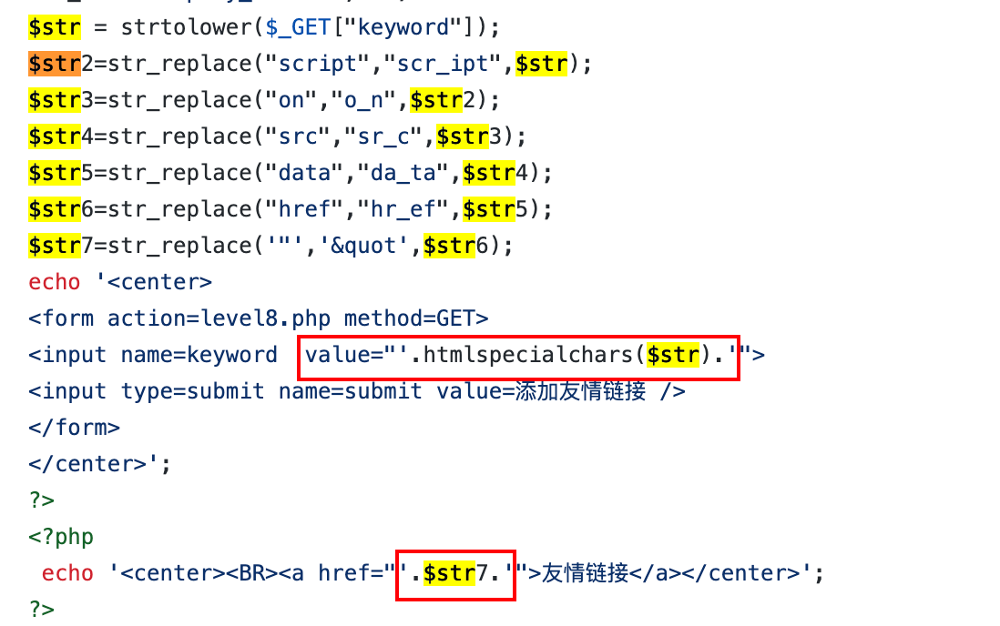

# 1.6-xss

##  1.1-xss-漏洞详解

- 需要的基础知识: html,css,javascript,php，这些前端知识点只需要了解大概语法懂意思就好了，php后端只需要了解与前端交互的几个关键变量即可
- xss-labs下载链接：https://github.com/Re13orn/xss-lab.git
- 如果懒也可以直接在buuctf中开启xss-labs
- 

这里直接上一道题目来了解xss漏洞原理

可以看到下图中，在name变量上输入什么，则页面就打印什么内容


这里我们直接构造一个payload

```
<script>alert(1)</script>
```


可以发现我们在name的位置插入了一段js代码，由于js代码在前端打印出来之后会默认被解析，虽然是用户自己执行的，但是我们可以通过构造这样的链接直接发送给用户从而窃取信息，这也就是XSS漏洞了

想要找到一个xss漏洞很简单，如果看到存在交互式页面，并且可以提交数据，提交的数据可以回显出来，这个时候只需要检测有没有什么过滤，如果能绕过过滤就可以构造出xss的漏洞payload了

接下来通过xss-labs学习xss漏洞以及过滤绕过技巧

## 2.1-level-2

- 

- htmlspecialchars函数：把预定义的字符 "<" （小于）和 ">" （大于）转换为 HTML 实体,也就是说这里的htmlspecialchars会将<>转化为html中的实体

- 

- 

- 通过查看源码可以发现value的地方没有过滤str，因此我们呢可以添加一个闭合标签，构造以下payload

- ```
  "><script>alert(1)</script><"
  ```

- 

- 可以发现绕过成功

## 2.2-level-3

- 

- 查看第三关源码可以发现这回两边都处理了特殊符号

- 

- 查看函数的转换机制

- 

- 发现默认是ent_compat，不会对单引号进行转换

- 接下来我们测试一下

- 

- 可以发现我们的单引号没有被转换

- 

- 因此我们可以闭合单引号，但是无法闭合右尖括号，所以我们不能使用script的形式来构造payload了，需要使用鼠标事件，或者单击事件

- 

- 以上是常见的html事件

- 

- 可以看到在html中可以直接写入一些js代码，因此我们构造payload

- ```
  ' oneclick=alert(1) '
  ```

  

- 

- 然后点击一下输入框就可以了

## 2.3-level-4

- 

- 查看第四关源码可以发现，对方先过滤了<>然后打印出来的时候添加了转换实体函数，但是输入框的位置并没有做过滤，也就相当于现在只过滤了尖括号，那么我们可以使用js中的事件绕过尖括号即可，因为js中的事件不需要<>

- 构造payload

- ```
  " onclick='alert(1)' "
  ```

- 绕过成功

## 2.4-level-5

- 

- 分析第五关的源码，可以发现这里有两种过滤，第一种是替换，将<script标签替换为<scr_ipt，将on替换为o_n，第二种则是将字符转换为预定义编码

- js伪协议

- 

- 这个伪协议必须在url上面才能生效，因此我们必须构造一个a标签或者img标签

- 这里我们尝试使用js的为协议绕过，构造以下payload

- ```
  "><a href="javascript:alert(1)">
  ```

- 

## 2.5-level-6

- 

- 查看源码可以发现和上一题差不多，只不过过滤更加多了，但是这里没有将所有字符转换为大写或者小写，因此可以尝试大小写绕过

- 因此构造以下payload

- ```
  " oNclick=alert(1) "
  ```

- 

- 绕过成功

## 2.6-level-7

- 

- 分析源码，这里的替换和上面不太一样了，是替换为空，那么我们可以使用双写绕过

- 比如一个script会被替换为空，那么我们在script中再夹杂一个script那么替换掉一个script之后就只剩下一个script了

- 构造以下payload

- ```
    " oonnclick=alert(1) "
  ```

- 

- 绕过成功

## 2.7-level-8

- 

- 通过分析代码可以发现，前面几个关卡的构造已经没有用了，这里因为是生成一个链接，所以我们可以使用html实体编码来绕过上面的替换函数，比如script，我们只需要将t修改为实体编码&#116就可以了，因为在html中，链接是以显示出来的为准，而不是编码，因此我们可以构造以下payload

- ```
  javascrip&#116:alert`1`
  ```

- 这里面的反引号可以代替括号，&#116通过实体编码转移过来就是t

- 

- 复制友情链接地址

- ```
  javascript:alert`1`
  ```

- 可以发现这里的t已经恢复了

## 2.8-level-9

- 

- 分析源码，可以发现，相较于上一关，这里多了一个关键字判断，如果存在http://则打印出来，如果不存在，则不打印出来

- 因此这里我们可以利用实体编码+关键字构造一个payload

- ```
  javascrip&#116&#58alert('http://xxx')
  ```

- 转换后的链接是以下内容

  ```
  javascript:alert('http://xxx')
  ```

## 2.9-level-10

- 

- 分析源码，可以发现这里隐藏了输入框，由于代码是在前端，是由我们自己的电脑解析，因此可以直接修改源码

- 

- 修改一个t_sort的输入框源码之后很快可以看到出现了一个输入框，接下来分析一下源码，这个隐藏的输入框过滤了尖括号，因此我们可以采用js事件完成绕过

- 构造以下payload

- ```
  " onclick=alert`1` "
  ```

- 

- 添加好payload之后我们将type中的hidden删除即可

- xss暂时更新到这里


