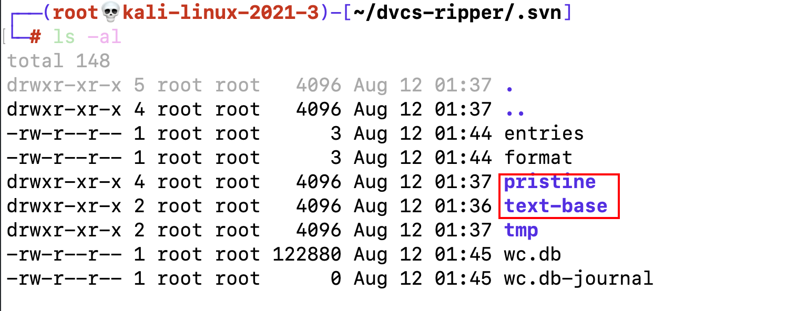

# 1.3-svn泄露

## 1.1-SvnHack工具介绍

- 一个Svn信息泄露辅助工具，可以使用这个脚本列取网站目录，读取源码文件以及下载整站代码。

- ### example :

  - ```
    python2 svnhack.py -u http://challenge-ec35cddd2da95103.sandbox.ctfhub.com:10800/.svn/
    ```

    

- 这条命令会dump下所有的泄露文件

## 1.2-svn目录详解

- .svn目录

  - 使用svn checkout后，项目目录下会生成隐藏的.svn文件夹（Linux上用ls命令看不到，要用ls -al命令）。 

  - svn1.6及以前版本会在项目的每个文件夹下都生成一个.svn文件夹，里面包含了所有文件的备份，文件名为 .svn/text-base/文件名.svn-base。

  - svn1.7及以后版本则只在项目根目录生成一个.svn文件夹，里面的pristine文件夹里包含了整个项目的所有文件备份。



可以看到当前两个文件目录，都可能存在备份文件，由于我们不知道svn的版本，所以依次查看目录中的文件即可得到flag